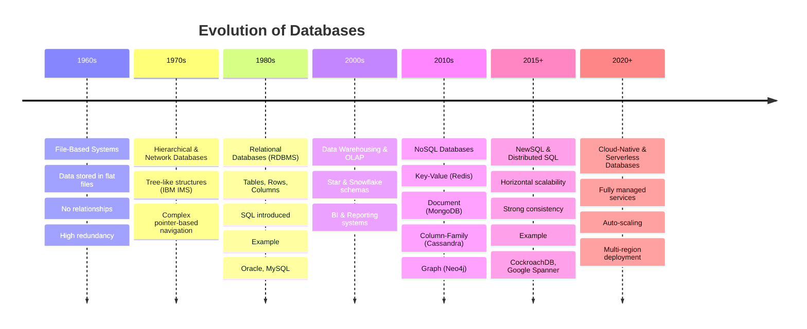

# Database Internals Book

पुस्तकाच्या प्रस्तावनेमध्ये (Preface) डेटाबेस सिस्टीमचा इतिहास, पुस्तकाचा उद्देश आणि त्याची रचना याबद्दल सविस्तर माहिती दिली आहे. या प्रस्तावनेचा सारांश खालीलप्रमाणे आहे:

**डेटाबेसची उत्क्रांती:**

प्रस्तावनेमध्ये २००० सालापासूनच्या डेटाबेसच्या प्रवासाचे वर्णन केले आहे. सुरुवातीला प्रामुख्याने रिलेशनल डेटाबेस (relational databases) वापरले जायचे. त्यानंतर cloud-based सेवांच्या वाढत्या लोकप्रियतेमुळे सिस्टीमची क्षमता वाढवण्यासाठी horizontal scaling वर भर दिला गेला. २०१० च्या सुमारास NoSQL आणि 'इव्हेंच्युअल कन्सिस्टन्सी' (eventually consistent) असलेल्या डेटाबेसचा (उदा. Apache Cassandra, Riak) उदय झाला. मात्र, आता पुन्हा एकदा अधिक स्केलेबल आणि स्ट्राँग कन्सिस्टन्सी (strong consistency) देणाऱ्या डेटाबेसकडे कल वाढत आहे.

**हे पुस्तक कोणासाठी आहे?**

अनेक पुस्तकांमध्ये स्टोरेज इंजिनच्या अंतर्गत (internals) कार्याबद्दल सविस्तर माहिती नसते, त्यामुळे या पुस्तकात त्या गोष्टींवर भर देण्यात आला आहे. हे पुस्तक फक्त डेटाबेस बनवणाऱ्यांसाठीच नाही, तर सॉफ्टवेअर डेव्हलपर्स, रिलायबिलिटी इंजिनिअर्स, आर्किटेक्ट्स आणि इंजिनिअरिंग मॅनेजर्ससाठीही उपयुक्त आहे. यामुळे इंजिनिअर्सना ट्रबलशूटिंग करणे आणि समस्यांचे मूळ कारण शोधणे सोपे जाते.

**हे पुस्तक का वाचावे?**

डेटाबेसच्या मूळ संकल्पना आणि अल्गोरिदम कधीही जुने होत नाहीत. हे अल्गोरिदम आणि त्यांचा इतिहास समजून घेतल्याने तांत्रिक चर्चा करण्यासाठी एक सामायिक भाषा (common language) मिळते, ज्यामुळे गुंतागुंतीच्या संकल्पनांवर चर्चा करणे अधिक सोपे होते.

**पुस्तकाची व्याप्ती आणि रचना:**

हे पुस्तक कोणत्याही एका विशिष्ट प्रकारच्या (उदा. रिलेशनल किंवा NoSQL) डेटाबेसपुरते मर्यादित नाही, तर सर्व प्रकारच्या डेटाबेसमध्ये वापरल्या जाणाऱ्या अल्गोरिदम आणि संकल्पनांवर लक्ष केंद्रित करते, विशेषतः 'स्टोरेज इंजिन' आणि 'डिस्ट्रीब्युशन' या दोन घटकांवर. यासाठी लेखकाने अनेक पुस्तके आणि ३०० हून अधिक पेपर्सचा अभ्यास केला आहे. पुस्तकाची प्रामुख्याने दोन भागांत विभागणी केली आहे:

* **भाग १ (Storage Engines):** या भागात डेटाबेस आर्किटेक्चर आणि डेटा कसा स्टोअर केला जातो यावर लक्ष केंद्रित केले आहे. यामध्ये
  * डिस्क-बेस्ड स्ट्रक्चर्स,
  * बी-ट्रीज (B-Trees) आणि त्याचे प्रकार,
  * तसेच लॉग-स्ट्रक्चर्ड स्टोरेज (log-structured storage) यांसारख्या नोड-लोकल (node-local) प्रक्रियांविषयी माहिती दिली आहे.
* **भाग २ (Distributed Systems):** या भागात डेटा कसा डिस्ट्रीब्यूट केला जातो हे सांगितले आहे. यामध्ये
  * डिस्ट्रीब्युटेड सिस्टीममधील आव्हाने,
  * फेल्युअर डिटेक्शन (failure detection),
  * लीडर इलेक्शन (leader election),
  * रेप्लिकेशन आणि कन्सिस्टन्सी (replication and consistency),
  * गॉसिप प्रोटोकॉल, आणि
  * कन्सेंसस (consensus) यांसारख्या अत्यंत महत्त्वाच्या संकल्पनांची सविस्तर चर्चा केली आहे.

