# Your Database Has a Secret Life — And You've Never Seen It
### *Database Internals Series — Chapter 1 — Introduction and Overview*

---

> *You've been using databases for years.  
> Writing queries, creating tables, adding indexes.*  
> *But here's the thing — you've been talking to a receptionist.*  
> *This chapter takes you past reception, through the corridor, and into the engine room.*

---

## 🏭 The Moment That Changes Everything

Imagine you walk into a massive fulfillment warehouse — like Amazon's.

From outside, it looks simple: you order something, it arrives.  
But inside? There are conveyor belts, barcode scanners, sorting algorithms, robots, inventory systems, and hundreds of coordinated decisions happening every second.

**That's your database.**

Every `SELECT`, every `INSERT`, every `UPDATE` — triggers a cascade of internal decisions that most developers never see.

Chapter 1 of *Database Internals* pulls back the curtain. It doesn't teach you SQL. It shows you the warehouse.

---

## 🗺️ What This Chapter Covers

```markmap
# Chapter 1 — Introduction and Overview

## DBMS Architecture
### The layers inside every database
- Transport Layer
- Query Processor
- Query Optimizer
- Execution Engine
- Storage Engine

## Memory vs Disk-Based DBMS
### Where does data actually live?
- In-Memory Databases (Redis, VoltDB)
- Disk-Based Databases (PostgreSQL, MySQL)
- Durability in memory stores
- Non-Volatile Memory (NVM) — the future

## Column vs Row-Oriented DBMS
### How is data laid out on disk?
- Row-Oriented (MySQL, PostgreSQL)
- Column-Oriented (ClickHouse, Redshift)
- Wide Column Stores (HBase, Cassandra)
- When to choose which

## Data Files and Index Files
### How databases find your data fast
- Heap Files
- Hash-Organized Files
- Index-Organized Tables (IOT)
- Primary vs Secondary Indexes
- Clustered vs Non-Clustered Indexes

## Buffering, Immutability, Ordering
### The three forces shaping all storage engines
- Buffering — collect before writing
- Immutability — append-only vs in-place
- Ordering — sorted vs insertion order
```

---

## 🏗️ Part 1: The DBMS Architecture — What Actually Happens When You Run a Query?

You type:
```sql
SELECT name, phone FROM users WHERE id = 42;
```

And get back: `John | +1 111 222 333`

Looks simple. But here's what actually happened inside:

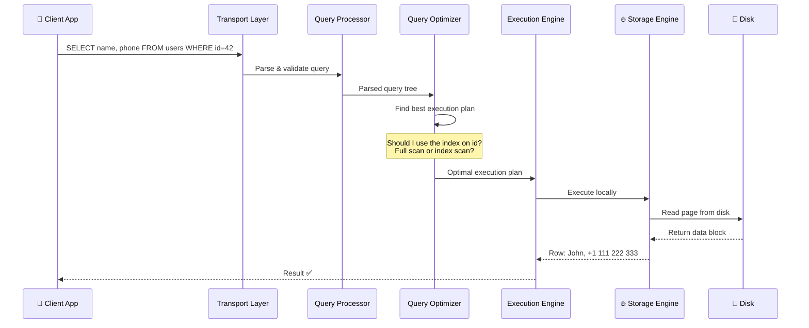

**Five layers.** Five distinct responsibilities. Every single query passes through all of them.

### The Storage Engine — The Real Hero

Inside the Storage Engine live five critical managers:

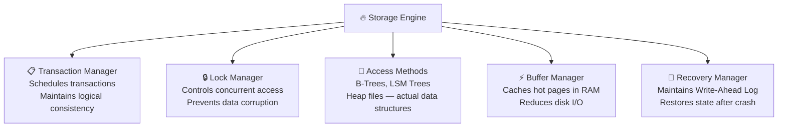

> 🤯 **Mind-bender:** The Transaction Manager and Lock Manager work *together* to achieve concurrency control — ensuring that two users updating the same record simultaneously don't corrupt each other's data. This is happening thousands of times per second in production systems, silently, invisibly.

---

## 💾 Part 2: Memory vs Disk — Where Does Your Data Really Live?

Here's the brutal truth about storage media:

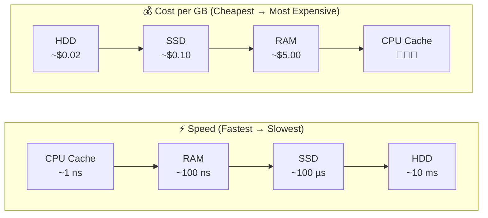

This single trade-off — **speed vs cost vs durability** — is why two entirely different classes of databases exist.

### In-Memory Databases (e.g., Redis, VoltDB, Memcached)

- Store data **primarily in RAM**
- Blazing fast — no disk I/O for reads
- But RAM is **volatile** — power off, data gone
- Solution: **Write-Ahead Log (WAL)** + periodic **checkpointing** to disk

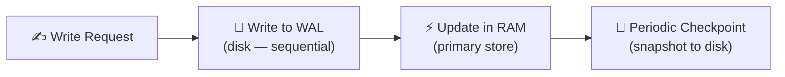

> 💡 **Interesting fact:** A checkpoint is like hitting "Save" in a video game. The WAL is the play-by-play log. After a crash, the database loads the last checkpoint and *replays* only the WAL entries after it. No need to replay everything from the beginning.

### Disk-Based Databases (e.g., PostgreSQL, MySQL, SQLite)

- Store data **primarily on disk**
- Use RAM as a **buffer/cache** (the Buffer Manager's job)
- Slower than in-memory, but **durable by default**
- Disk-based structures need to be fundamentally different — wide, shallow trees (more on this in Blog 2!)

> 🧠 **Key insight from the book:** An in-memory database is NOT just "a disk database with a huge RAM cache." The internal data structures, layout, and optimizations are fundamentally different. In-memory stores can use pointers freely; disk stores cannot, because pointers mean random seeks, and random disk seeks are catastrophically slow.

---

## 📊 Part 3: Row vs Column — The Layout That Changes Everything

This is one of the most practically important concepts in the chapter — and most developers confuse it.

### Imagine a user table:

| ID | Name  | Birth Date  | Phone          |
|----|-------|-------------|----------------|
| 10 | John  | 01 Aug 1981 | +1 111 222 333 |
| 20 | Sam   | 14 Sep 1988 | +1 555 888 999 |
| 30 | Keith | 07 Jan 1984 | +1 333 444 555 |

**How this is stored on disk is a fundamental design decision.**

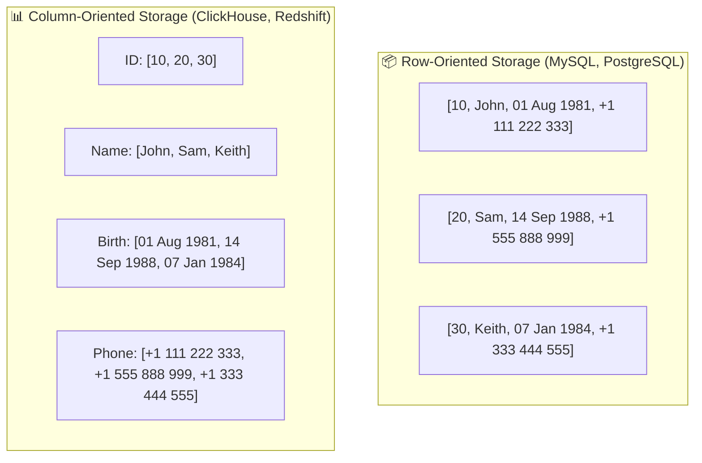

### When does each shine?

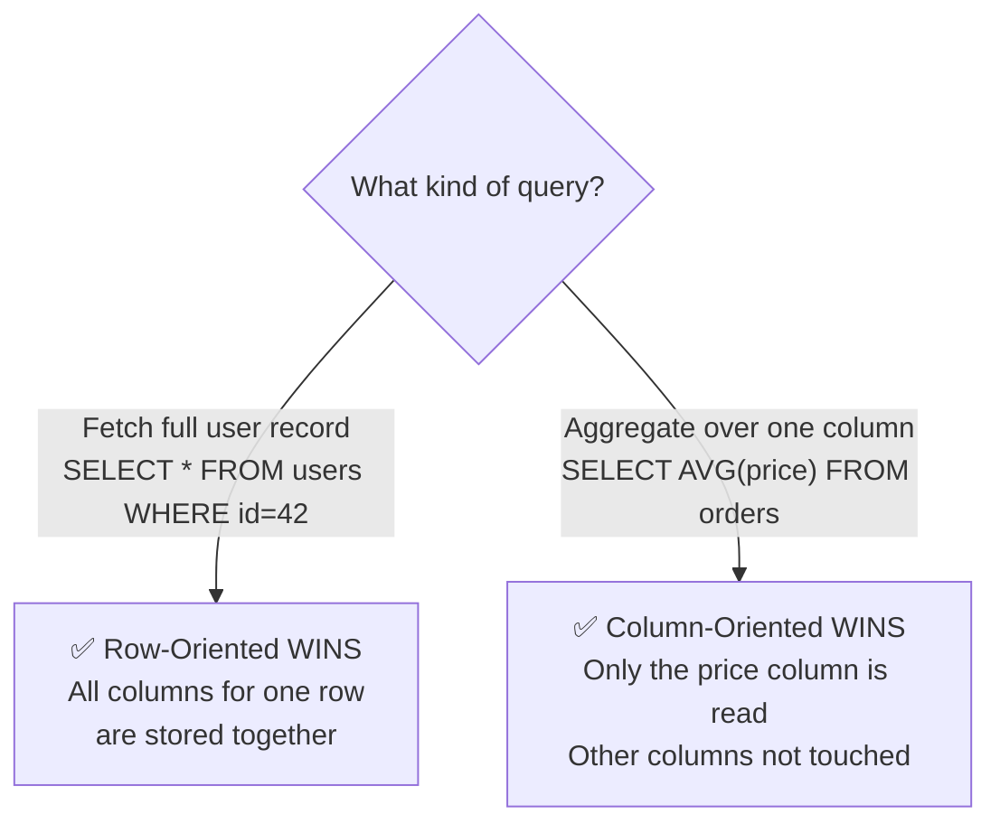

> 💡 **Real-world:** Zomato's order management system (millions of CRUD operations per second) needs row-oriented storage. Zomato's analytics team calculating average delivery time by city over 3 years of data? Column-oriented all the way.

### Column-Oriented: The Hidden Superpower — Compression

When you store all values of the same type together, something magical happens:

- `[DOW, DOW, DOW, S&P, S&P, S&P]` → compresses to almost nothing
- Same data type means same compression algorithm can be applied
- Modern CPUs can even process multiple column values **in a single CPU instruction** (SIMD — Single Instruction, Multiple Data)

> 🤯 **Mind-bender:** Column stores don't just read less data — they can also compute faster because modern CPUs are designed for vectorized operations. A single CPU instruction can add 8 numbers at once if they're stored contiguously. Row stores can't take advantage of this.

### Wait — What About Wide Column Stores?

This is where most developers get confused. **Cassandra and HBase are NOT column-oriented stores.** They are **wide column stores** — completely different.

```markmap
# Column-Oriented vs Wide Column — The Confusion

## Column-Oriented (ClickHouse, Redshift, Parquet)
### Good for analytics
- Stores each column contiguously on disk
- Great for aggregations: AVG, SUM, COUNT
- Example: "What's the average order value this month?"

## Wide Column Stores (Cassandra, HBase, BigTable)
### Good for key-based access
- Data organized as multidimensional map
- Columns grouped into "column families"
- Within each family, data stored ROW-WISE by key
- Example: "Get all activity for user_id=42"
- NOT for analytical aggregations
```

> 💡 **The key difference:** In a wide column store, you're still fetching data by a *key* (like a row key). The "wide" part means each row can have thousands of columns, not that analytics are fast. BigTable's famous Webtable stores web page snapshots by reversed URL — `com.cnn.www` — with all versions and attributes. That's a key-value lookup, not analytical aggregation.

---

## 📁 Part 4: Data Files and Index Files — How Databases Find Your Data

Here's a question most people never think about: **Why can't a database just be a folder of CSV files?**

The answer: **efficiency** — in three dimensions.

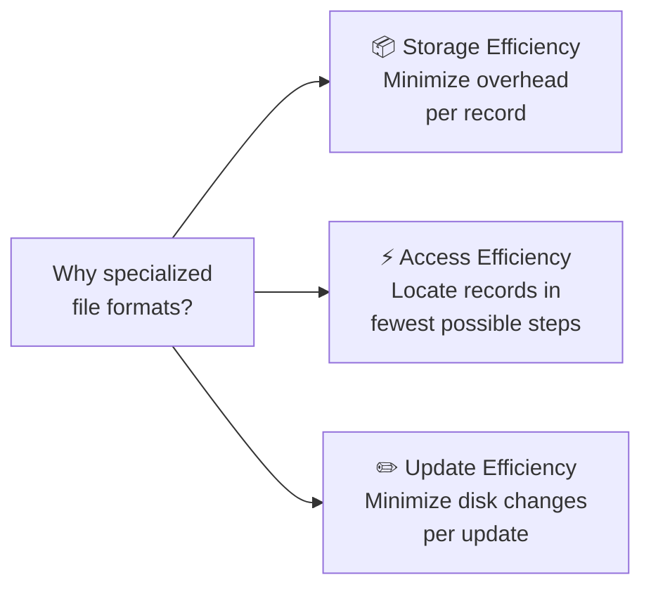

### The Three Ways to Organize Data Files

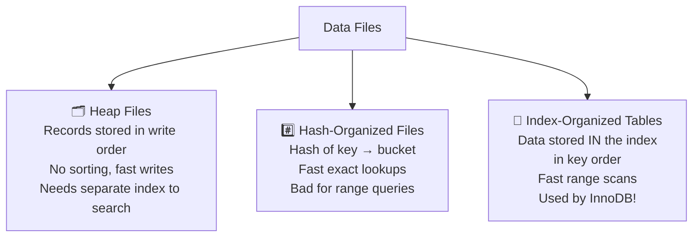

> 💡 **MySQL InnoDB fact:** InnoDB uses Index-Organized Tables. Your primary key is the tree. The actual row data lives inside the B+ Tree leaf nodes. This is why choosing a good primary key in MySQL is so important — it directly affects the physical layout of your data on disk.

### Primary vs Secondary Indexes — And Why It Matters

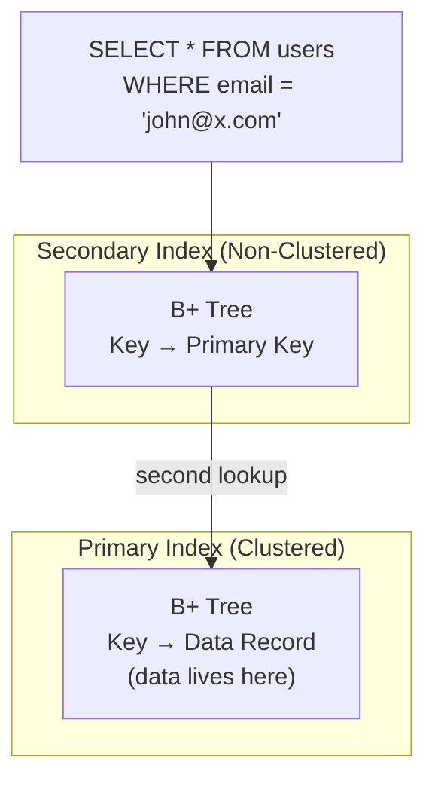

> 🤯 **Performance insight:** When MySQL InnoDB uses a secondary index, it does **two** B+ Tree lookups — first in the secondary index to find the primary key, then in the primary index to get the actual row. This is called a *double lookup*. For read-heavy workloads, this overhead matters. For write-heavy workloads, this design reduces the cost of pointer updates when rows move.

### The Tombstone Pattern — How Deletes Actually Work

Here's something that surprises most developers:

> **Databases don't actually delete data immediately.**

When you run `DELETE FROM orders WHERE id = 5`, most modern storage engines write a **tombstone** — a deletion marker — and move on.

The actual space is reclaimed later during **garbage collection**, which reads pages, keeps live records, and discards tombstoned ones.

Why? Because deleting in-place would mean rewriting pages, which is expensive. Appending a tombstone is cheap.

---

## ⚡ Part 5: The Three Forces — Buffering, Immutability, and Ordering

This is the conceptual core of the entire book.

Every storage engine ever built makes three fundamental choices.  
These choices determine its personality — its strengths, its weaknesses, its ideal use case.

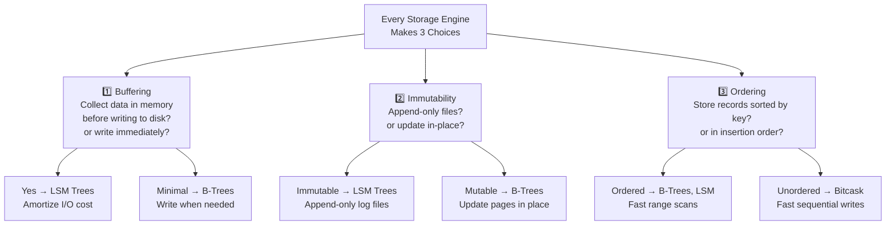

### The Trade-off Triangle

```markmap
# The Three Forces and Their Trade-offs

## Buffering
### What it means
- Collect writes in memory, flush in batches
- Amortizes expensive I/O operations
### Who uses it
- LSM Trees buffer heavily (MemTable → SSTable)
- B-Trees use minimal buffering
### Trade-off
- More buffering = faster writes, slower crash recovery

## Immutability
### What it means
- Never modify written data
- Only append new data or copy-on-write
### Who uses it
- LSM Trees: append-only SSTables
- LMDB: copy-on-write B-Trees
### Trade-off
- Immutable = simpler concurrency, more space needed

## Ordering
### What it means
- Store keys sorted on disk
- Adjacent keys physically near each other
### Who uses it
- B-Trees: always sorted
- Bitcask / WiscKey: insertion order (unordered)
### Trade-off
- Ordered = fast range scans, slower random writes
- Unordered = fast writes, expensive range scans
```

> 💬 B-Trees and LSM Trees — the two dominant storage structures in all of databases — are really just different answers to these three questions. B-Trees say: *minimal buffering, mutable in-place updates, always ordered.* LSM Trees say: *heavy buffering, immutable append-only files, ordered only at flush time.* Everything else — performance, trade-offs, ideal use cases — flows from these three choices.

---

## 🏷️ Putting It All Together — A Classification Map

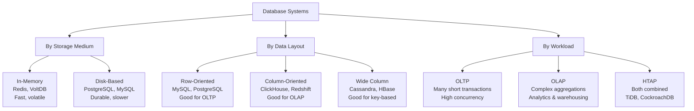

---

## 🤯 Chapter 1 — The Facts Worth Sharing

> 💡 **Fact:** MySQL InnoDB adds an invisible auto-increment primary key column to every table that doesn't have one. Your table always has a primary key — whether you defined it or not.

> 💡 **Fact:** When a database "deletes" a record, it often just writes a tombstone marker. The data physically stays on disk until garbage collection runs. This is why storage reclamation (`VACUUM` in PostgreSQL, `OPTIMIZE TABLE` in MySQL) is a real maintenance task.

> 💡 **Fact:** Column-oriented databases can use SIMD CPU instructions to process 8 numeric values in a single clock cycle by storing them contiguously. A row-oriented store physically cannot do this — the values are interleaved with other column data.

> 💡 **Fact:** The famous Bigtable (from Google's 2006 paper) stores web page snapshots by **reversed URL** — so `com.cnn.www` instead of `www.cnn.com`. Why reversed? Because sorted storage means all `com.cnn.*` pages end up physically adjacent on disk, making range scans over an entire domain blindingly fast.

---

## 👨‍🏫 What This Means for How We Teach Databases

For over a decade, I taught students that "MySQL is a relational database and Cassandra is NoSQL."

What I should have been teaching:

- MySQL (InnoDB) uses a **disk-based, row-oriented, index-organized** storage engine
- Cassandra uses a **disk-based, wide-column, LSM Tree-based** storage engine
- Redshift uses a **disk-based, column-oriented** engine optimized for analytical workloads

The *how* and *why* of each choice — that's what this chapter unlocks.

> **"Trying to compare databases based on their components, rank, or implementation language can lead to invalid and premature conclusions."**  
> — Alex Petrov, Database Internals

The right question is never *"which database is better?"*  
The right question is *"which storage model fits my access patterns?"*

---

## 💻 A Developer's Cheat Sheet from Chapter 1

| Question | Answer from this chapter |
|---|---|
| Why is MySQL slow on `SELECT AVG(price) FROM orders`? | Row-oriented: reads entire rows to get just the price column |
| Why is Cassandra bad for analytics? | Wide column: optimized for key lookups, not aggregations |
| Why does Redis lose data on power failure? | In-memory: volatile by default, needs WAL + checkpointing |
| Why is `DELETE` in PostgreSQL not instant? | Tombstones first, VACUUM reclaims space later |
| Why does InnoDB care so much about primary keys? | Data is stored IN the primary index (IOT) — key choice = data layout |
| What makes ClickHouse so fast for aggregations? | Column-oriented + SIMD vectorization + better compression |

---

## ⏭️ What's Next?

**Blog 2** dives into **Chapter 2: B-Tree Basics** — the most important data structure in all of databases.

We'll explore:
- Why Binary Search Trees fail on disk — and what B-Trees do differently
- Why B+ Trees store data only in leaf nodes (and why that's genius)
- How a B-Tree handles inserts, splits, and merges
- The math behind why 1 billion records need only 3–4 disk reads

*Spoiler: The B-Tree is 50 years old. It was invented in 1970. And yet, it still powers MySQL, PostgreSQL, SQLite, MongoDB, and Oracle today. That's not legacy code — that's a perfect design.*

---

## 📝 Chapter 1 — Summary in One Mindmap

```markmap
# Chapter 1 Summary

## DBMS Architecture
- 5 layers: Transport → Query Processor → Optimizer → Execution → Storage
- Storage Engine has 5 managers
- Transaction + Lock = Concurrency Control

## Memory vs Disk
- In-memory: fast, volatile, WAL + checkpointing for durability
- Disk-based: durable, slower, buffer manager caches hot pages
- NOT interchangeable — fundamentally different structures

## Row vs Column vs Wide Column
- Row: best for OLTP, full record access
- Column: best for OLAP, aggregations, compression
- Wide Column: best for key-based access, NOT analytics

## Data & Index Files
- 3 file types: Heap, Hash, Index-Organized
- Primary index: usually clustered
- Secondary index: non-clustered, may need double lookup
- Deletes = tombstones, reclaimed by garbage collection

## The Three Forces
- Buffering: batch writes to amortize I/O
- Immutability: append-only vs in-place update
- Ordering: sorted by key vs insertion order
- B-Trees vs LSM Trees = different answers to these 3 questions
```

---

*📌 This blog is based on Chapter 1 of "Database Internals: A Deep Dive into How Distributed Data Systems Work" by Alex Petrov (O'Reilly, 2019). All concepts are explained in the author's own interpretation for educational purposes.*

*🙏 Found this useful? Share it with a developer who thinks they know databases — this chapter will make them reconsider.*

---

**Tags:** `#DatabaseInternals` `#StorageEngines` `#DBMS` `#BTree` `#LSMTree` `#ColumnStore` `#SystemDesign` `#AlexPetrov` `#LearnInPublic` `#Hashnode`
