# आपके डेटाबेस की एक गुप्त ज़िंदगी है — और आपने उसे कभी देखा नहीं
### *Database Internals Series — Chapter 1 — परिचय और अवलोकन*

---

> *आप सालों से databases इस्तेमाल करते आए हैं।*  
> *Queries लिखीं, tables बनाईं, indexes डाले।*  
> *लेकिन सच यह है — आप अब तक receptionist से बात करते रहे।*  
> *यह chapter आपको reception पार कराता है, corridor से ले जाता है — सीधे engine room में।*

---

## 🏭 वह पल जो सब बदल देता है

कल्पना कीजिए — आप Amazon जैसे किसी विशाल fulfillment warehouse में घुस रहे हैं।

बाहर से सब आसान लगता है: आप order करते हैं, सामान आ जाता है।  
लेकिन अंदर? Conveyor belts, barcode scanners, sorting algorithms, robots, inventory systems — और हर सेकंड सैकड़ों coordinated फैसले।

**यही आपका database है।**

हर `SELECT`, हर `INSERT`, हर `UPDATE` — अंदरूनी फैसलों की एक पूरी श्रृंखला शुरू करता है, जो ज़्यादातर developers कभी नहीं देखते।

*Database Internals* का Chapter 1 वह पर्दा हटाता है।  
यह SQL नहीं सिखाता। यह warehouse दिखाता है।

---

## 🗺️ यह Chapter क्या बताता है

```markmap
# Chapter 1 — परिचय और अवलोकन

## DBMS Architecture
### हर database के अंदर के थर
- Transport Layer
- Query Processor
- Query Optimizer
- Execution Engine
- Storage Engine

## Memory vs Disk-Based DBMS
### Data असल में कहाँ रहता है?
- In-Memory Databases (Redis, VoltDB)
- Disk-Based Databases (PostgreSQL, MySQL)
- Memory stores में durability कैसे मिलती है
- Non-Volatile Memory (NVM) — भविष्य

## Column vs Row-Oriented DBMS
### Disk पर data कैसे सजा होता है?
- Row-Oriented (MySQL, PostgreSQL)
- Column-Oriented (ClickHouse, Redshift)
- Wide Column Stores (HBase, Cassandra)
- कौन सा कब चुनें?

## Data Files और Index Files
### Database आपका data इतनी तेज़ी से कैसे ढूँढता है?
- Heap Files
- Hash-Organized Files
- Index-Organized Tables (IOT)
- Primary vs Secondary Indexes
- Clustered vs Non-Clustered Indexes

## Buffering, Immutability, Ordering
### हर storage engine को आकार देने वाली तीन शक्तियाँ
- Buffering — पहले जमा करो, फिर लिखो
- Immutability — append-only vs in-place update
- Ordering — sorted vs insertion order
```

---

## 🏗️ भाग १: DBMS Architecture — Query चलाने पर अंदर असल में क्या होता है?

आप लिखते हैं:
```sql
SELECT name, phone FROM users WHERE id = 42;
```

और मिलता है: `John | +1 111 222 333`

आसान लगता है। लेकिन अंदर जो हुआ, वह कुछ ऐसा था:

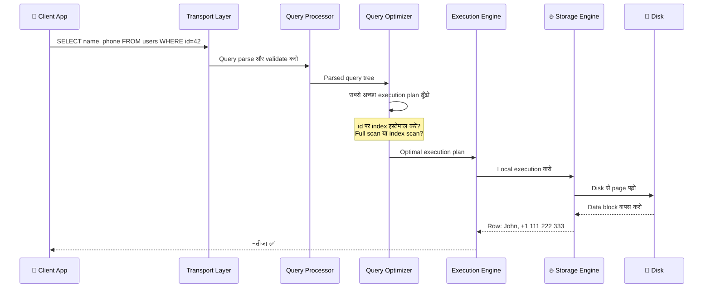

**पाँच थर।** पाँच अलग ज़िम्मेदारियाँ। हर query इन सबसे गुज़रती है।

### Storage Engine — असली हीरो

Storage Engine के अंदर पाँच ज़रूरी managers होते हैं:

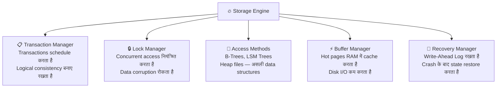

> 🤯 **सोचने पर मजबूर करने वाला:** Transaction Manager और Lock Manager *मिलकर* concurrency control करते हैं — यानी दो users एक ही वक्त एक ही record update करें तो भी data नहीं बिगड़ता। Production systems में यह हर सेकंड हज़ारों बार होता है — चुपचाप, अदृश्य रूप से।

---

## 💾 भाग २: Memory vs Disk — आपका Data असल में कहाँ रहता है?

Storage माध्यमों की कड़वी सच्चाई:

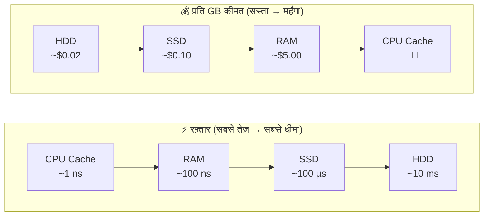

यही एक trade-off — **रफ़्तार vs कीमत vs durability** — दो बिल्कुल अलग तरह के databases के होने की वजह है।

### In-Memory Databases (जैसे Redis, VoltDB, Memcached)

- Data **मुख्यतः RAM में** रखते हैं
- बेहद तेज़ — reads के लिए disk I/O नहीं
- लेकिन RAM **volatile** है — बिजली गई तो data गया
- हल: **Write-Ahead Log (WAL)** + नियमित **checkpointing** disk पर

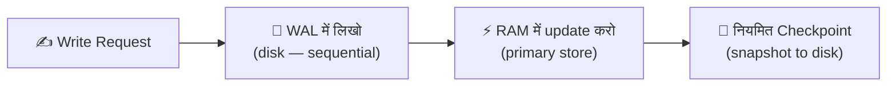

> 💡 **दिलचस्प तथ्य:** Checkpoint का मतलब है video game में "Save" दबाना। WAL हर पल का log है। Crash के बाद database आखिरी checkpoint लोड करता है और सिर्फ उसके बाद के WAL entries replay करता है। शुरू से सब कुछ replay करने की ज़रूरत नहीं।

### Disk-Based Databases (जैसे PostgreSQL, MySQL, SQLite)

- Data **मुख्यतः disk पर** रखते हैं
- RAM को **buffer/cache** की तरह इस्तेमाल करते हैं (Buffer Manager का काम)
- In-memory से धीमे, लेकिन **डिफ़ॉल्ट रूप से durable**
- Disk-based structures मौलिक रूप से अलग होनी चाहिए — चौड़े, उथले trees (Blog 2 में और जानें!)

> 🧠 **किताब का अहम सबक:** In-memory database का मतलब "बहुत बड़े RAM cache वाला disk database" नहीं है। अंदर की data structures, layout, और optimizations मौलिक रूप से अलग होती हैं। In-memory stores pointers आज़ादी से इस्तेमाल कर सकते हैं; disk stores नहीं कर सकते — क्योंकि pointers का मतलब random seeks है, और random disk seeks विनाशकारी रूप से धीमे होते हैं।

---

## 📊 भाग ३: Row vs Column — सब कुछ बदल देने वाली रचना

यह chapter का सबसे ज़्यादा काम आने वाला concept है — और ज़्यादातर developers इसमें उलझे रहते हैं।

### एक users table की कल्पना करें:

| ID | Name  | Birth Date  | Phone          |
|----|-------|-------------|----------------|
| 10 | John  | 01 Aug 1981 | +1 111 222 333 |
| 20 | Sam   | 14 Sep 1988 | +1 555 888 999 |
| 30 | Keith | 07 Jan 1984 | +1 333 444 555 |

**इसे disk पर कैसे रखा जाए — यह एक बुनियादी design फैसला है।**

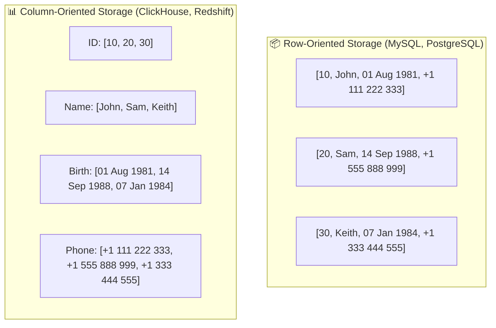

### कौन सा कब काम आता है?

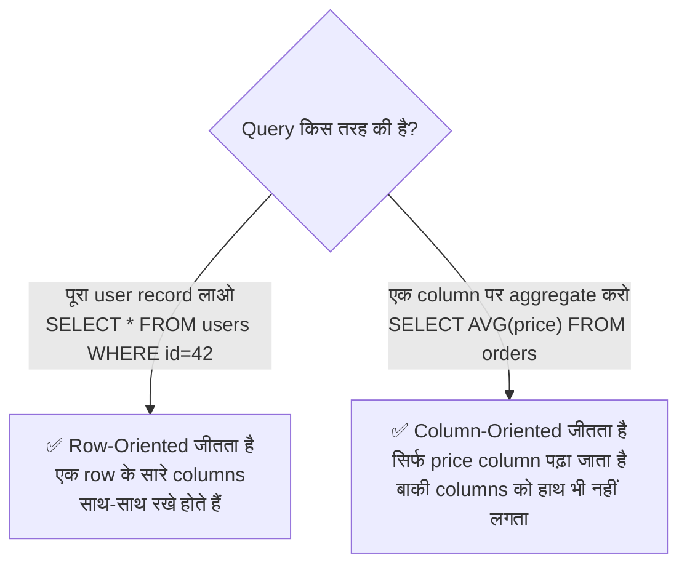

> 💡 **असली दुनिया का उदाहरण:** Zomato के order management system को (हर सेकंड लाखों CRUD operations) row-oriented storage चाहिए। Zomato की analytics team को ३ साल के data में से शहरवार औसत delivery समय निकालना हो? वहाँ column-oriented ही काम आएगा।

### Column-Oriented की छुपी महाशक्ति — Compression

जब आप एक ही type की सारी values एकसाथ रखते हैं, तो एक जादू होता है:

- `[DOW, DOW, DOW, S&P, S&P, S&P]` → लगभग शून्य पर compress हो जाता है
- एक ही data type मतलब एक ही compression algorithm लगाया जा सकता है
- आधुनिक CPUs एक ही CPU instruction में कई column values process कर सकते हैं — इसे **SIMD (Single Instruction, Multiple Data)** कहते हैं

> 🤯 **सोचने पर मजबूर करने वाला:** Column stores सिर्फ कम data नहीं पढ़ते — वे तेज़ compute भी करते हैं। आधुनिक CPUs vectorized operations के लिए बने हैं। एक ही CPU instruction में ८ numbers एकसाथ जुड़ जाते हैं — अगर वे contiguously रखे हों। Row stores यह नहीं कर सकते।

### रुकिए — Wide Column Stores क्या होते हैं?

यहीं ज़्यादातर developers उलझ जाते हैं। **Cassandra और HBase column-oriented stores नहीं हैं।** वे **wide column stores** हैं — यह बिल्कुल अलग बात है।

```markmap
# Column-Oriented vs Wide Column — उलझन दूर करें

## Column-Oriented (ClickHouse, Redshift, Parquet)
### Analytics के लिए बेहतरीन
- हर column disk पर contiguously रखता है
- Aggregations के लिए उम्दा: AVG, SUM, COUNT
- उदाहरण: "इस महीने का औसत order value क्या है?"

## Wide Column Stores (Cassandra, HBase, BigTable)
### Key-based access के लिए बेहतरीन
- Data multidimensional map की तरह सजा होता है
- Columns "column families" में बँटे होते हैं
- हर family में data key के हिसाब से ROW-WISE रखा होता है
- उदाहरण: "user_id=42 की सारी activity लाओ"
- Analytical aggregations के लिए नहीं
```

> 💡 **असली फर्क:** Wide column store में आप अभी भी *key* से data ढूँढते हैं। "Wide" का मतलब है हर row में हज़ारों columns हो सकते हैं — analytics तेज़ होती है ऐसा नहीं। BigTable के मशहूर Webtable में web pages reversed URL से रखी जाती हैं — `com.cnn.www` — सारे versions और attributes के साथ। यह key-value lookup है, analytical aggregation नहीं।

---

## 📁 भाग ४: Data Files और Index Files — Database आपका Data कैसे ढूँढता है?

एक सवाल जो ज़्यादातर लोग कभी नहीं पूछते: **Database सिर्फ CSV files का एक folder क्यों नहीं हो सकता?**

जवाब: **efficiency** — तीन आयामों में।

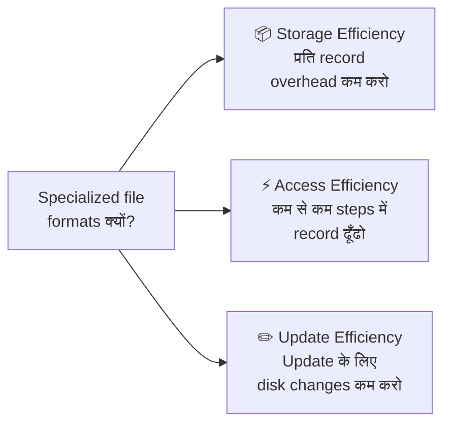

### Data Files सजाने के तीन तरीके

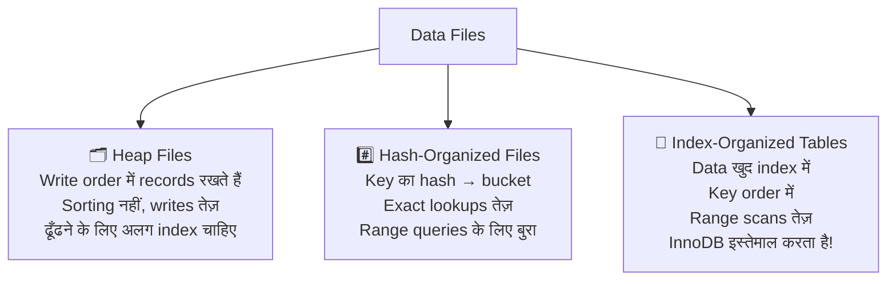

> 💡 **MySQL InnoDB की बात:** InnoDB Index-Organized Tables इस्तेमाल करता है। Primary key ही tree है। असली row data B+ Tree के leaf nodes में रहता है। इसीलिए MySQL में अच्छी primary key चुनना इतना ज़रूरी है — यह सीधे आपके data का disk पर physical layout तय करता है।

### Primary vs Secondary Indexes — और यह क्यों मायने रखता है

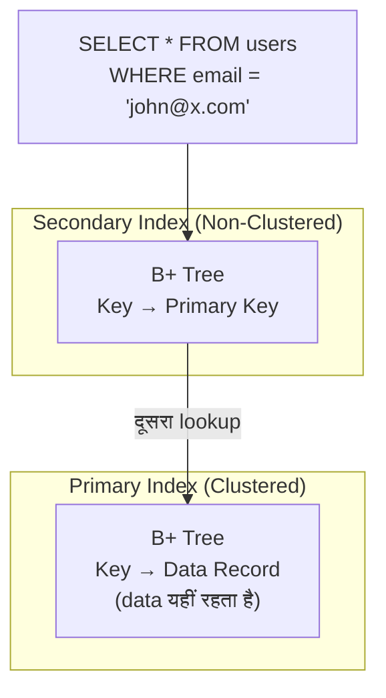

> 🤯 **Performance का झटका:** MySQL InnoDB secondary index इस्तेमाल करते वक्त **दो** B+ Tree lookups करता है — पहले secondary index में primary key ढूँढता है, फिर primary index में असली row। इसे *double lookup* कहते हैं। Read-heavy workloads के लिए यह overhead मायने रखता है। Write-heavy workloads के लिए यह design rows हिलने पर pointer updates सस्ते कर देता है।

### Tombstone Pattern — Delete असल में कैसे काम करता है?

यह बात ज़्यादातर developers को हैरान करती है:

> **Databases data फौरन delete नहीं करते।**

जब आप `DELETE FROM orders WHERE id = 5` चलाते हैं, तो ज़्यादातर modern storage engines एक **tombstone** — deletion marker — लिखते हैं और आगे बढ़ जाते हैं।

असली जगह बाद में **garbage collection** में खाली होती है — जो pages पढ़ता है, live records रखता है, और tombstoned records हटा देता है।

क्यों? क्योंकि in-place delete का मतलब है pages rewrite करना — जो महँगा है। Tombstone append करना सस्ता है।

---

## ⚡ भाग ५: तीन शक्तियाँ — Buffering, Immutability, और Ordering

यह पूरी किताब का conceptual केंद्र है।

आज तक बने हर storage engine ने तीन बुनियादी फैसले किए।  
ये फैसले उसकी पहचान तय करते हैं — उसकी ताक़त, कमज़ोरी, आदर्श use case।

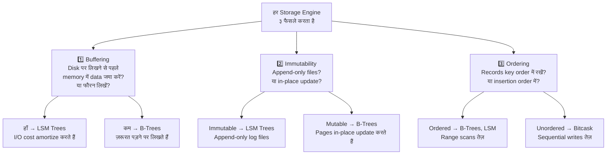

### Trade-off Triangle

```markmap
# तीन शक्तियाँ और उनके Trade-offs

## Buffering
### मतलब क्या है
- Writes memory में जमा करो, batches में flush करो
- महँगे I/O operations amortize करो
### कौन इस्तेमाल करता है
- LSM Trees भारी buffering करते हैं (MemTable → SSTable)
- B-Trees कम buffering इस्तेमाल करते हैं
### Trade-off
- ज़्यादा buffering = writes तेज़, crash recovery धीमी

## Immutability
### मतलब क्या है
- लिखा हुआ data कभी बदलो नहीं
- सिर्फ नया data append करो या copy-on-write
### कौन इस्तेमाल करता है
- LSM Trees: append-only SSTables
- LMDB: copy-on-write B-Trees
### Trade-off
- Immutable = concurrency आसान, ज़्यादा जगह चाहिए

## Ordering
### मतलब क्या है
- Keys sorted order में disk पर रखो
- नज़दीकी keys physically पास-पास होती हैं
### कौन इस्तेमाल करता है
- B-Trees: हमेशा sorted
- Bitcask / WiscKey: insertion order (unordered)
### Trade-off
- Ordered = range scans तेज़, random writes धीमे
- Unordered = writes तेज़, range scans महँगे
```

> 💬 **सारांश पंचलाइन:** B-Trees और LSM Trees — databases की दुनिया के दो सबसे बड़े storage structures — असल में इन्हीं तीन सवालों के अलग-अलग जवाब हैं। B-Trees कहते हैं: *कम buffering, mutable in-place updates, हमेशा ordered।* LSM Trees कहते हैं: *भारी buffering, immutable append-only files, flush के वक्त ही ordered।* बाकी सब — performance, trade-offs, ideal use cases — इन्हीं तीन चुनावों से निकलता है।

---

## 🏷️ सब एक साथ — एक Classification Map

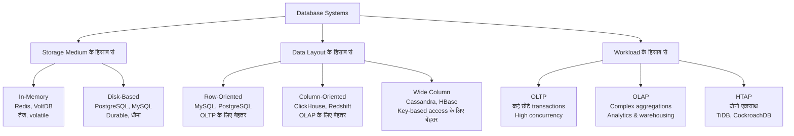

---

## 🤯 Chapter 1 — Share करने लायक तथ्य

> 💡 **तथ्य:** MySQL InnoDB हर उस table में एक invisible auto-increment primary key column जोड़ता है जिसमें primary key नहीं होती। आपकी table में हमेशा primary key होती है — चाहे आपने define की हो या नहीं।

> 💡 **तथ्य:** जब database किसी record को "delete" करता है, तो वह अक्सर सिर्फ tombstone marker लिखता है। Garbage collection होने तक data असल में disk पर रहता है। इसीलिए PostgreSQL का `VACUUM` और MySQL का `OPTIMIZE TABLE` असली maintenance tasks हैं।

> 💡 **तथ्य:** Column-oriented databases SIMD CPU instructions से एक ही clock cycle में ८ numeric values process कर सकते हैं — क्योंकि वे contiguously रखी होती हैं। Row-oriented store यह नहीं कर सकता — values दूसरे column data के बीच बिखरी होती हैं।

> 💡 **तथ्य:** Google के मशहूर Bigtable (2006 paper) में web pages **reversed URL** से रखी जाती हैं — `www.cnn.com` की बजाय `com.cnn.www`। क्यों? क्योंकि sorted storage से सारे `com.cnn.*` pages disk पर physically पास-पास आ जाते हैं — पूरे domain के range scans बिजली की तरह तेज़ हो जाते हैं।

---

## 👨‍🏫 इससे मेरे पढ़ाने पर क्या असर पड़ता है

दस साल से भी ज़्यादा समय तक मैं छात्रों को पढ़ाता रहा — "MySQL एक relational database है और Cassandra NoSQL है।"

जो मुझे पढ़ाना चाहिए था:

- MySQL (InnoDB) एक **disk-based, row-oriented, index-organized** storage engine इस्तेमाल करता है
- Cassandra एक **disk-based, wide-column, LSM Tree-based** storage engine इस्तेमाल करता है
- Redshift एक **disk-based, column-oriented** engine इस्तेमाल करता है — analytical workloads के लिए optimize किया गया

हर चुनाव के पीछे का *कैसे* और *क्यों* — यही यह chapter खोलता है।

> **"Databases की तुलना उनके components, rank, या implementation language के आधार पर करने से गलत और जल्दबाज़ी में निकाले गए निष्कर्ष मिल सकते हैं।"**  
> — Alex Petrov, Database Internals

सही सवाल कभी *"कौन सा database बेहतर है?"* नहीं होता।  
सही सवाल है — *"मेरे access patterns के लिए कौन सा storage model सही है?"*

---

## 💻 Chapter 1 का Developer Cheat Sheet

| सवाल | इस chapter से जवाब |
|---|---|
| `SELECT AVG(price) FROM orders` MySQL पर slow क्यों? | Row-oriented: सिर्फ price column के लिए पूरी rows पढ़ता है |
| Cassandra analytics के लिए क्यों बुरा है? | Wide column: key lookups के लिए optimize, aggregations नहीं |
| Redis में बिजली गई तो data क्यों जाता है? | In-memory: volatile by default, WAL + checkpointing चाहिए |
| PostgreSQL में `DELETE` फौरन क्यों नहीं होता? | पहले tombstones, VACUUM बाद में जगह खाली करता है |
| InnoDB primary keys की इतनी परवाह क्यों करता है? | Data primary index में ही रखा होता है (IOT) — key चुनाव = data layout |
| ClickHouse aggregations के लिए इतना तेज़ क्यों? | Column-oriented + SIMD vectorization + बेहतर compression |

---

## ⏭️ आगे क्या?

**Blog 2** में हम **Chapter 2: B-Tree Basics** में जाएँगे — databases की सबसे ज़रूरी data structure।

हम जानेंगे:
- Binary Search Trees disk पर क्यों नाकाम होते हैं — और B-Trees क्या अलग करते हैं
- B+ Trees सिर्फ leaf nodes में data क्यों रखते हैं (और यह कितना चतुर है)
- B-Tree inserts, splits, और merges कैसे handle करता है
- १ अरब records के लिए सिर्फ ३-४ disk reads क्यों लगते हैं इसका गणित

*Spoiler: B-Tree ५० साल पुरानी है। यह १९७० में बनी थी। फिर भी आज MySQL, PostgreSQL, SQLite, MongoDB, और Oracle इसी पर चलते हैं। यह पुराना code नहीं है — यह एक परिपूर्ण design है।*

---

## 📝 Chapter 1 — एक Mindmap में सारांश

```markmap
# Chapter 1 सारांश

## DBMS Architecture
- ५ थर: Transport → Query Processor → Optimizer → Execution → Storage
- Storage Engine में ५ managers
- Transaction + Lock = Concurrency Control

## Memory vs Disk
- In-memory: तेज़, volatile, WAL + checkpointing durability के लिए
- Disk-based: durable, धीमा, buffer manager hot pages cache करता है
- आपस में नहीं बदल सकते — मौलिक रूप से अलग structures

## Row vs Column vs Wide Column
- Row: OLTP के लिए बेहतर, पूरा record access
- Column: OLAP के लिए बेहतर, aggregations, compression
- Wide Column: key-based access के लिए बेहतर, analytics नहीं

## Data & Index Files
- ३ file types: Heap, Hash, Index-Organized
- Primary index: आमतौर पर clustered
- Secondary index: non-clustered, double lookup लग सकता है
- Deletes = tombstones, garbage collection से reclaimed

## तीन शक्तियाँ
- Buffering: I/O amortize करने के लिए writes batch करो
- Immutability: append-only vs in-place update
- Ordering: key के हिसाब से sorted vs insertion order
- B-Trees vs LSM Trees = इन ३ सवालों के अलग-अलग जवाब
```

---

*📌 यह blog Alex Petrov की "Database Internals: A Deep Dive into How Distributed Data Systems Work" (O'Reilly, 2019) के Chapter 1 पर आधारित है। सभी अवधारणाएँ शैक्षणिक उद्देश्य से लेखक के अपने शब्दों में प्रस्तुत की गई हैं।*

*🙏 यह उपयोगी लगा? किसी ऐसे developer को share करें जो कहता है उसे databases आते हैं — यह chapter उसे दोबारा सोचने पर मजबूर कर देगा।*

---

**Tags:** `#DatabaseInternals` `#StorageEngines` `#DBMS` `#BTree` `#LSMTree` `#ColumnStore` `#SystemDesign` `#AlexPetrov` `#LearnInPublic` `#Hashnode`
