# तुमच्या डेटाबेसचं एक गुप्त आयुष्य आहे — आणि तुम्ही ते कधीच पाहिलं नाही
### *Database Internals Series — Chapter 1 — ओळख आणि आढावा*

---

> *तुम्ही वर्षानुवर्षे databases वापरत आलात.*  
> *Queries लिहिल्या, tables बनवल्या, indexes टाकल्या.*  
> *पण खरं सांगायचं तर — तुम्ही आतापर्यंत receptionist शी बोलत होतात.*  
> *हा chapter तुम्हाला reception पार करून, corridor मधून नेतो — थेट engine room मध्ये.*

---

## 🏭 जो क्षण सगळं बदलतो

कल्पना करा — तुम्ही Amazon सारख्या एखाद्या प्रचंड मोठ्या warehouse मध्ये शिरत आहात.

बाहेरून सगळं सोपं दिसतं: तुम्ही order करता, वस्तू येते.  
पण आत? Conveyor belts, barcode scanners, sorting algorithms, robots, inventory systems — आणि प्रत्येक सेकंदाला शेकडो coordinated निर्णय.

**तेच तुमचा database आहे.**

प्रत्येक `SELECT`, प्रत्येक `INSERT`, प्रत्येक `UPDATE` — अंतर्गत निर्णयांची एक साखळी सुरू करतो, जी बहुतांश developers कधीच पाहत नाहीत.

*Database Internals* चा Chapter 1 तो पडदा बाजूला करतो.  
हे SQL शिकवत नाही. हे warehouse दाखवतं.

---

## 🗺️ हा Chapter काय सांगतो

```markmap
# Chapter 1 — ओळख आणि आढावा

## DBMS Architecture
### प्रत्येक database च्या आतले थर
- Transport Layer
- Query Processor
- Query Optimizer
- Execution Engine
- Storage Engine

## Memory vs Disk-Based DBMS
### Data खरोखर कुठे राहतो?
- In-Memory Databases (Redis, VoltDB)
- Disk-Based Databases (PostgreSQL, MySQL)
- Memory stores मध्ये durability कशी मिळवतात
- Non-Volatile Memory (NVM) — भविष्य

## Column vs Row-Oriented DBMS
### Disk वर data कसा मांडलेला असतो?
- Row-Oriented (MySQL, PostgreSQL)
- Column-Oriented (ClickHouse, Redshift)
- Wide Column Stores (HBase, Cassandra)
- कोणतं कधी निवडायचं?

## Data Files आणि Index Files
### Database तुमचा data इतक्या वेगाने कसा शोधतो?
- Heap Files
- Hash-Organized Files
- Index-Organized Tables (IOT)
- Primary vs Secondary Indexes
- Clustered vs Non-Clustered Indexes

## Buffering, Immutability, Ordering
### प्रत्येक storage engine ला आकार देणाऱ्या तीन शक्ती
- Buffering — आधी जमवा, मग लिहा
- Immutability — append-only vs in-place update
- Ordering — sorted vs insertion order
```

---

## 🏗️ भाग १: DBMS Architecture — Query चालवली की आत नक्की काय होतं?

तुम्ही लिहिता:
```sql
SELECT name, phone FROM users WHERE id = 42;
```

आणि मिळतं: `John | +1 111 222 333`

सोपं वाटतं. पण आत जे घडलं ते असं होतं:

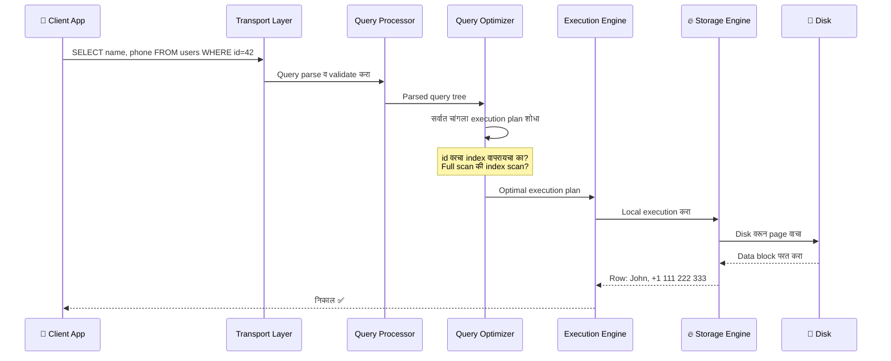

**पाच थर.** पाच वेगळ्या जबाबदाऱ्या. प्रत्येक query या सर्वांमधून जाते.

### Storage Engine — खरा नायक

Storage Engine च्या आत पाच महत्त्वाचे managers असतात:

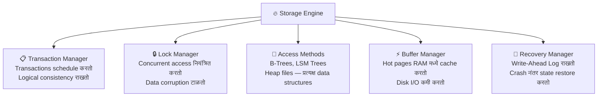

> 🤯 **विचार करायला लावणारं:** Transaction Manager आणि Lock Manager *एकत्र* concurrency control साधतात — म्हणजे दोन वापरकर्ते एकाच वेळी एकच record update करत असतील तरी data बिघडत नाही. Production systems मध्ये हे प्रत्येक सेकंदाला हजारो वेळा घडत असतं — शांतपणे, अदृश्यपणे.

---

## 💾 भाग २: Memory vs Disk — तुमचा Data खरोखर कुठे राहतो?

Storage माध्यमांबद्दलची कठोर वास्तवता:

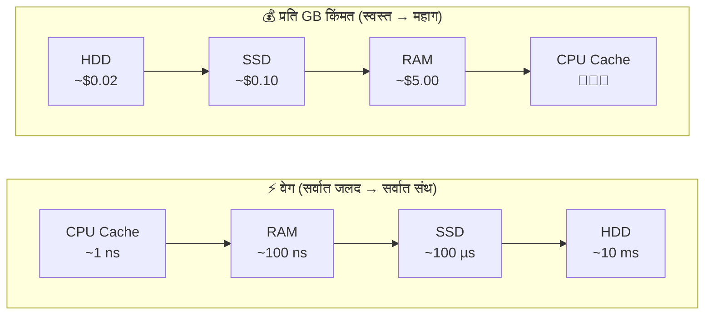

हा एकच trade-off — **वेग vs किंमत vs durability** — दोन पूर्णपणे वेगळ्या प्रकारचे databases का अस्तित्वात आहेत याचं उत्तर आहे.

### In-Memory Databases (उदा. Redis, VoltDB, Memcached)

- Data **प्रामुख्याने RAM मध्ये** साठवतात
- अत्यंत जलद — reads साठी disk I/O नाही
- पण RAM **volatile** आहे — वीज गेली की data गेला
- उपाय: **Write-Ahead Log (WAL)** + नियमित **checkpointing** disk वर

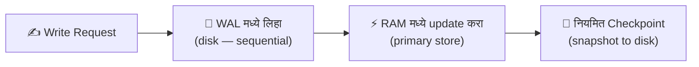

> 💡 **रोचक तथ्य:** Checkpoint म्हणजे video game मध्ये "Save" दाबण्यासारखं आहे. WAL म्हणजे प्रत्येक क्षणाचा log. Crash नंतर database शेवटचा checkpoint लोड करतो आणि फक्त त्यानंतरचे WAL entries replay करतो. सुरुवातीपासून सगळं replay करायची गरज नाही.

### Disk-Based Databases (उदा. PostgreSQL, MySQL, SQLite)

- Data **प्रामुख्याने disk वर** साठवतात
- RAM **buffer/cache** म्हणून वापरतात (Buffer Manager चं काम)
- In-memory पेक्षा संथ, पण **दीर्घकाळ टिकणारे**
- Disk-based structures मूलतः वेगळ्या असाव्या लागतात — रुंद, उथळ trees (Blog 2 मध्ये अधिक!)

> 🧠 **पुस्तकातील महत्त्वाचा मुद्दा:** In-memory database म्हणजे "RAM cache असलेला disk database" नाही. आतील data structures, layout, आणि optimizations मूलतः वेगळ्या असतात. In-memory stores pointers मुक्तपणे वापरू शकतात; disk stores करू शकत नाहीत — कारण pointers म्हणजे random seeks, आणि random disk seeks विनाशकारी slow असतात.

---

## 📊 भाग ३: Row vs Column — सगळं बदलवणारी रचना

हे chapter मधील सर्वात व्यावहारिकदृष्ट्या महत्त्वाचं concept आहे — आणि बहुतांश developers याबाबत गोंधळलेले असतात.

### एक users table कल्पा:

| ID | Name  | Birth Date  | Phone          |
|----|-------|-------------|----------------|
| 10 | John  | 01 Aug 1981 | +1 111 222 333 |
| 20 | Sam   | 14 Sep 1988 | +1 555 888 999 |
| 30 | Keith | 07 Jan 1984 | +1 333 444 555 |

**हे disk वर कसं साठवायचं हा एक मूलभूत design निर्णय आहे.**

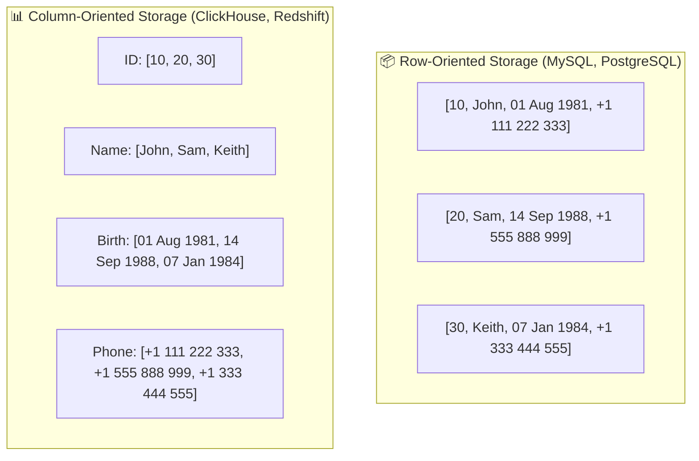

### कोणतं कधी उपयोगी पडतं?

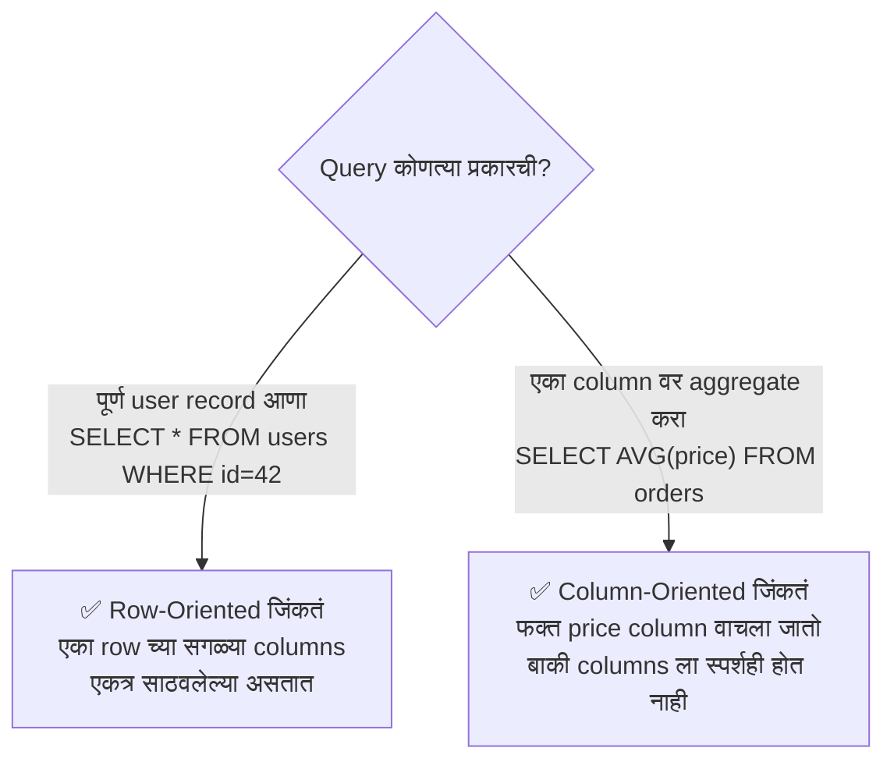

> 💡 **वास्तवातील उदाहरण:** Zomato च्या order management system ला (दर सेकंदाला लाखो CRUD operations) row-oriented storage हवं. Zomato च्या analytics team ला ३ वर्षांच्या data मधून शहरनिहाय सरासरी delivery वेळ काढायचा असेल? तिथे column-oriented च हवं.

### Column-Oriented ची छुपी महाशक्ती — Compression

जेव्हा तुम्ही एकाच type च्या सगळ्या values एकत्र साठवता, तेव्हा एक जादू होते:

- `[DOW, DOW, DOW, S&P, S&P, S&P]` → जवळपास शून्यावर compress होतं
- एकाच data type म्हणजे एकच compression algorithm वापरता येतो
- आधुनिक CPUs एकाच CPU instruction मध्ये अनेक column values process करू शकतात — याला **SIMD (Single Instruction, Multiple Data)** म्हणतात

> 🤯 **विचार करायला लावणारं:** Column stores फक्त कमी data वाचत नाहीत — ते faster पण compute करतात. आधुनिक CPUs vectorized operations साठी designed आहेत. एकाच CPU instruction मध्ये ८ numbers एकत्र add होतात — जर ते contiguously साठवलेले असतील तर. Row stores हे करू शकत नाहीत.

### थांबा — Wide Column Stores म्हणजे काय?

इथेच बहुतांश developers गोंधळतात. **Cassandra आणि HBase column-oriented stores नाहीत.** ते **wide column stores** आहेत — हे पूर्णपणे वेगळं आहे.

```markmap
# Column-Oriented vs Wide Column — गोंधळ दूर करूया

## Column-Oriented (ClickHouse, Redshift, Parquet)
### Analytics साठी उत्तम
- प्रत्येक column disk वर contiguously साठवतं
- Aggregations साठी उत्तम: AVG, SUM, COUNT
- उदाहरण: "या महिन्याचं सरासरी order value किती?"

## Wide Column Stores (Cassandra, HBase, BigTable)
### Key-based access साठी उत्तम
- Data multidimensional map म्हणून मांडलेला
- Columns "column families" मध्ये गटबद्ध
- प्रत्येक family आत, data key नुसार ROW-WISE साठवलेला
- उदाहरण: "user_id=42 ची सगळी activity आणा"
- Analytical aggregations साठी नाही
```

> 💡 **मुख्य फरक:** Wide column store मध्ये तुम्ही अजूनही *key* ने data शोधता. "Wide" म्हणजे प्रत्येक row मध्ये हजारो columns असू शकतात — analytics जलद होतात असं नाही. BigTable च्या प्रसिद्ध Webtable मध्ये web pages reversed URL ने साठवल्या जातात — `com.cnn.www` — सगळ्या versions आणि attributes सह. हे key-value lookup आहे, analytical aggregation नाही.

---

## 📁 भाग ४: Data Files आणि Index Files — Database तुमचा Data कसा शोधतो?

एक प्रश्न जो बहुतांश लोक कधीच विचारत नाहीत: **Database फक्त CSV files चं एक folder का असू शकत नाही?**

उत्तर: **efficiency** — तीन आयामांमध्ये.

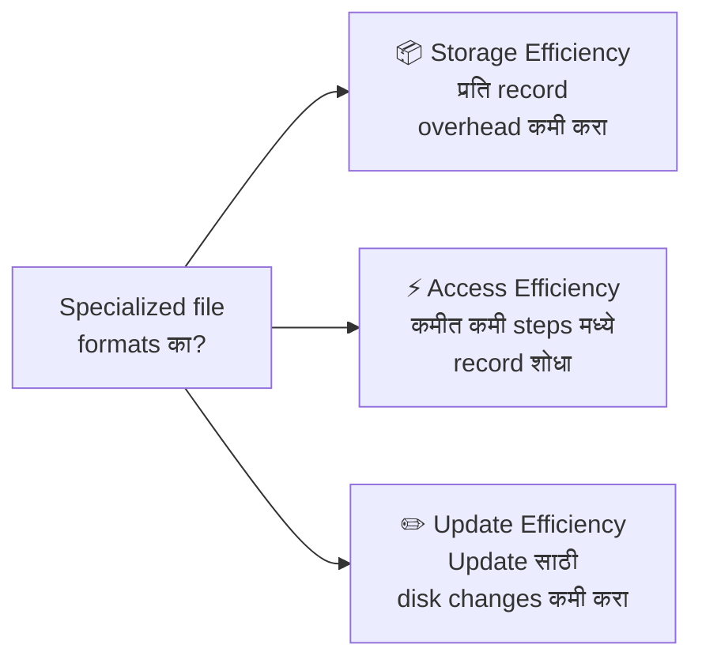

### Data Files मांडण्याचे तीन मार्ग

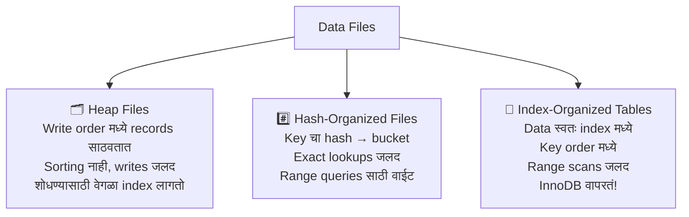

> 💡 **MySQL InnoDB बद्दल:** InnoDB Index-Organized Tables वापरतं. Primary key हीच tree आहे. प्रत्यक्ष row data B+ Tree च्या leaf nodes मध्ये राहतो. म्हणूनच MySQL मध्ये चांगली primary key निवडणं इतकं महत्त्वाचं आहे — ते तुमच्या data चं disk वरचं physical layout थेट ठरवतं.

### Primary vs Secondary Indexes — आणि हे का महत्त्वाचं आहे

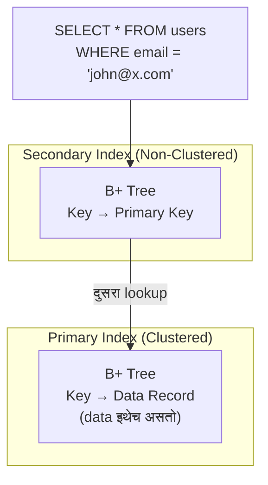

> 🤯 **Performance चा धक्का:** MySQL InnoDB secondary index वापरताना **दोन** B+ Tree lookups करतो — आधी secondary index मध्ये primary key शोधतो, मग primary index मध्ये प्रत्यक्ष row. याला *double lookup* म्हणतात. Read-heavy workloads साठी हा overhead महत्त्वाचा आहे. Write-heavy workloads साठी मात्र हा design rows हलवताना pointer updates स्वस्त करतो.

### Tombstone Pattern — Delete खरोखर कसं काम करतं?

हे बहुतांश developers ना आश्चर्यचकित करतं:

> **Databases data लगेच delete करत नाहीत.**

जेव्हा तुम्ही `DELETE FROM orders WHERE id = 5` चालवता, तेव्हा बहुतांश modern storage engines एक **tombstone** — deletion marker — लिहितात आणि पुढे जातात.

प्रत्यक्ष जागा नंतर **garbage collection** मध्ये मोकळी होते — जे pages वाचतं, live records ठेवतं, आणि tombstoned records टाकून देतं.

का? कारण in-place delete म्हणजे pages rewrite करणं — जे महागडं आहे. Tombstone append करणं स्वस्त आहे.

---

## ⚡ भाग ५: तीन शक्ती — Buffering, Immutability, आणि Ordering

हे या संपूर्ण पुस्तकाचं conceptual केंद्र आहे.

आजवर बनवलेला प्रत्येक storage engine तीन मूलभूत निर्णय घेतो.  
हे निर्णय त्याचं व्यक्तिमत्त्व ठरवतात — त्याची ताकद, कमकुवतपणा, आदर्श use case.

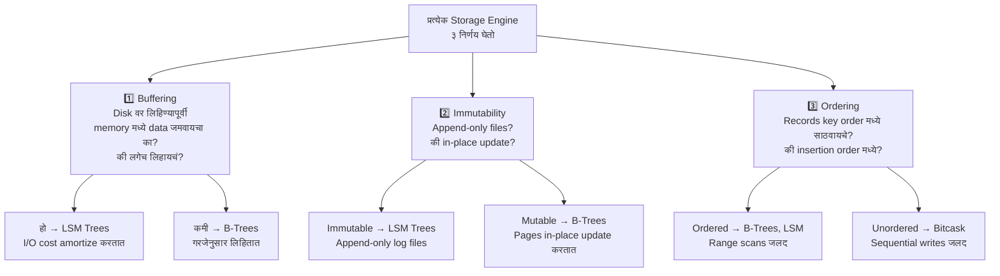

### Trade-off Triangle

```markmap
# तीन शक्ती आणि त्यांचे Trade-offs

## Buffering
### म्हणजे काय
- Writes memory मध्ये जमवा, batches मध्ये flush करा
- महागड्या I/O operations amortize करा
### कोण वापरतं
- LSM Trees जड buffering करतात (MemTable → SSTable)
- B-Trees कमी buffering वापरतात
### Trade-off
- जास्त buffering = writes जलद, crash recovery संथ

## Immutability
### म्हणजे काय
- लिहिलेला data कधीही बदलायचा नाही
- फक्त नवीन data append करा किंवा copy-on-write
### कोण वापरतं
- LSM Trees: append-only SSTables
- LMDB: copy-on-write B-Trees
### Trade-off
- Immutable = concurrency सोपी, जास्त जागा लागते

## Ordering
### म्हणजे काय
- Keys sorted order मध्ये disk वर साठवा
- जवळचे keys physically जवळ असतात
### कोण वापरतं
- B-Trees: नेहमी sorted
- Bitcask / WiscKey: insertion order (unordered)
### Trade-off
- Ordered = range scans जलद, random writes संथ
- Unordered = writes जलद, range scans महागडे
```

> 💬 **सारांश पंचलाइन:** B-Trees आणि LSM Trees — databases च्या जगातील दोन सर्वोत्कृष्ट storage structures — या तीन प्रश्नांची वेगवेगळी उत्तरं आहेत. B-Trees म्हणतात: *कमी buffering, mutable in-place updates, नेहमी ordered.* LSM Trees म्हणतात: *जड buffering, immutable append-only files, flush वेळीच ordered.* बाकी सगळं — performance, trade-offs, ideal use cases — या तीन निवडींमधूनच येतं.

---

## 🏷️ सगळं एकत्र — एक Classification Map

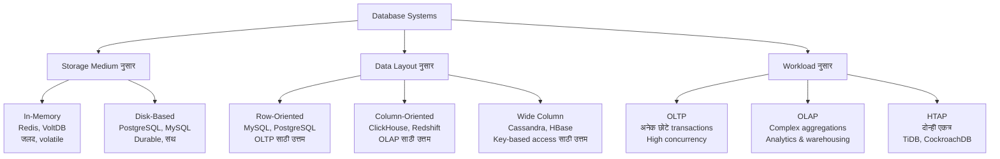

---

## 🤯 Chapter 1 — Share करण्यासारखी तथ्यं

> 💡 **तथ्य:** MySQL InnoDB प्रत्येक table ला जी primary key नाही तिला एक invisible auto-increment primary key column जोडतो. तुमच्या table ला नेहमीच primary key असते — तुम्ही define केली असो वा नसो.

> 💡 **तथ्य:** जेव्हा database एखादा record "delete" करतो, तेव्हा तो बऱ्याचदा फक्त tombstone marker लिहितो. Garbage collection होईपर्यंत data प्रत्यक्षात disk वरच राहतो. म्हणूनच PostgreSQL चा `VACUUM` आणि MySQL चा `OPTIMIZE TABLE` हे खरे maintenance tasks आहेत.

> 💡 **तथ्य:** Column-oriented databases SIMD CPU instructions वापरून एकाच clock cycle मध्ये ८ numeric values process करू शकतात — कारण ते contiguously साठवलेले असतात. Row-oriented store हे करू शकत नाही — values इतर column data मध्ये मिसळलेल्या असतात.

> 💡 **तथ्य:** Google च्या प्रसिद्ध Bigtable (2006 paper) मध्ये web pages **reversed URL** ने साठवल्या जातात — `www.cnn.com` ऐवजी `com.cnn.www`. का? कारण sorted storage मुळे सगळ्या `com.cnn.*` pages disk वर physically जवळ येतात — एखाद्या संपूर्ण domain वरचे range scans अत्यंत जलद होतात.

---

## 👨‍🏫 या गोष्टी माझ्या शिकवण्यावर कसा परिणाम करतात

दहा वर्षांहून अधिक काळ मी विद्यार्थ्यांना शिकवत होतो — "MySQL हा relational database आहे आणि Cassandra हा NoSQL आहे."

जे मला शिकवायला हवं होतं:

- MySQL (InnoDB) एक **disk-based, row-oriented, index-organized** storage engine वापरतं
- Cassandra एक **disk-based, wide-column, LSM Tree-based** storage engine वापरतं
- Redshift एक **disk-based, column-oriented** engine वापरतं — analytical workloads साठी optimize केलेलं

प्रत्येक निवडीमागचं *कसं* आणि *का* — हेच हा chapter उलगडतो.

> **"Databases ची तुलना त्यांच्या components, rank, किंवा implementation language वरून करणं चुकीच्या आणि घाईच्या निष्कर्षांकडे नेऊ शकतं."**  
> — Alex Petrov, Database Internals

योग्य प्रश्न कधीही *"कोणता database चांगला?"* असा नाही.  
योग्य प्रश्न आहे — *"माझ्या access patterns साठी कोणता storage model योग्य आहे?"*

---

## 💻 Chapter 1 मधील Developer Cheat Sheet

| प्रश्न | या chapter मधून उत्तर |
|---|---|
| `SELECT AVG(price) FROM orders` MySQL वर slow का? | Row-oriented: फक्त price column साठी पूर्ण rows वाचतं |
| Cassandra analytics साठी का वाईट? | Wide column: key lookups साठी optimize, aggregations नाही |
| Redis power गेली की data का जातो? | In-memory: volatile by default, WAL + checkpointing लागतं |
| PostgreSQL मध्ये `DELETE` लगेच का होत नाही? | आधी tombstones, VACUUM नंतर जागा मोकळी करतं |
| InnoDB primary keys बद्दल इतकी काळजी का घेतं? | Data primary index मध्येच साठवलेला (IOT) — key निवड = data layout |
| ClickHouse aggregations साठी इतकं जलद का? | Column-oriented + SIMD vectorization + उत्तम compression |

---

## ⏭️ पुढे काय?

**Blog 2** मध्ये आपण **Chapter 2: B-Tree Basics** मध्ये जाऊ — databases मधील सर्वात महत्त्वाची data structure.

आपण जाणून घेऊ:
- Binary Search Trees disk वर का अयशस्वी होतात — आणि B-Trees काय वेगळं करतात
- B+ Trees फक्त leaf nodes मध्ये data का साठवतात (आणि हे किती चतुर आहे)
- B-Tree inserts, splits, आणि merges कसं handle करतं
- १ अब्ज records साठी फक्त ३-४ disk reads का लागतात याचं गणित

*Spoiler: B-Tree ५० वर्षं जुना आहे. तो १९७० मध्ये तयार झाला. तरीही आजही MySQL, PostgreSQL, SQLite, MongoDB, आणि Oracle त्याच्यावर चालतात. हे जुनं code नाही — हे एक परिपूर्ण design आहे.*

---

## 📝 Chapter 1 — एका Mindmap मध्ये सारांश

```markmap
# Chapter 1 सारांश

## DBMS Architecture
- ५ थर: Transport → Query Processor → Optimizer → Execution → Storage
- Storage Engine मध्ये ५ managers
- Transaction + Lock = Concurrency Control

## Memory vs Disk
- In-memory: जलद, volatile, WAL + checkpointing durability साठी
- Disk-based: durable, संथ, buffer manager hot pages cache करतो
- परस्पर बदलता येणार नाहीत — मूलतः वेगळ्या structures

## Row vs Column vs Wide Column
- Row: OLTP साठी उत्तम, पूर्ण record access
- Column: OLAP साठी उत्तम, aggregations, compression
- Wide Column: key-based access साठी उत्तम, analytics नाही

## Data & Index Files
- ३ file types: Heap, Hash, Index-Organized
- Primary index: साधारणतः clustered
- Secondary index: non-clustered, double lookup लागू शकतो
- Deletes = tombstones, garbage collection ने reclaimed

## तीन शक्ती
- Buffering: I/O amortize करण्यासाठी writes batch करा
- Immutability: append-only vs in-place update
- Ordering: key नुसार sorted vs insertion order
- B-Trees vs LSM Trees = या ३ प्रश्नांची वेगवेगळी उत्तरं
```

---

*📌 हा blog Alex Petrov यांच्या "Database Internals: A Deep Dive into How Distributed Data Systems Work" (O'Reilly, 2019) च्या Chapter 1 वर आधारित आहे. सर्व संकल्पना शैक्षणिक उद्देशाने लेखकाच्या स्वतःच्या शब्दांत मांडल्या आहेत.*

*🙏 हे उपयुक्त वाटलं? एखाद्या developer मित्राला share करा जो म्हणतो त्याला databases माहीत आहेत — हा chapter त्याला पुन्हा विचार करायला लावेल.*

---
