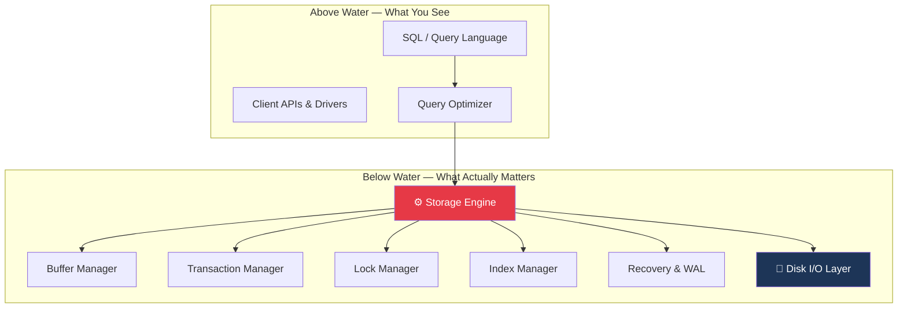
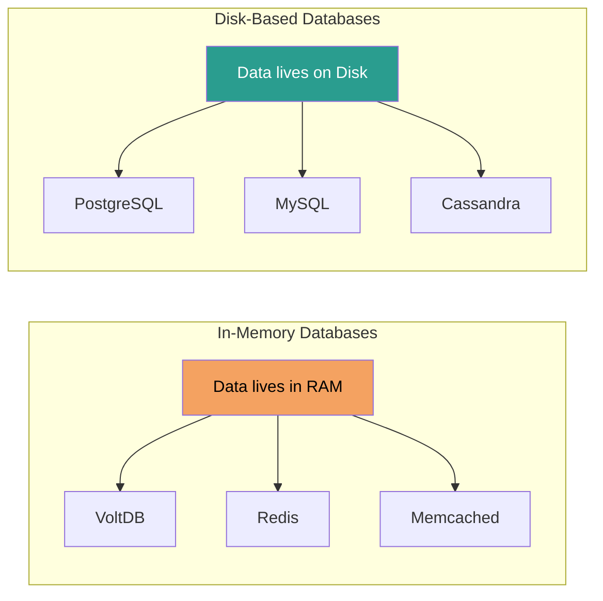
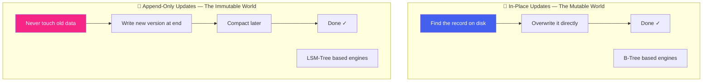
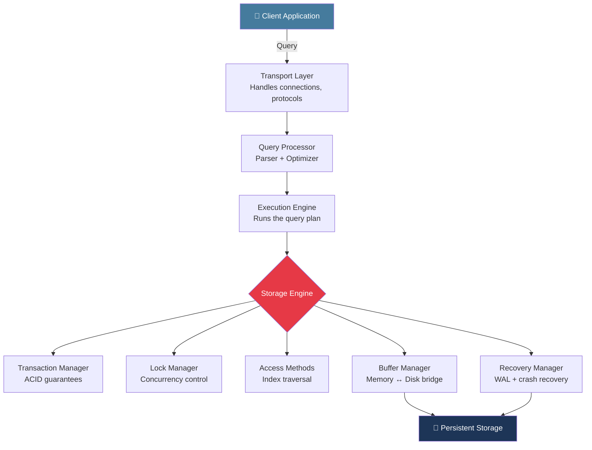
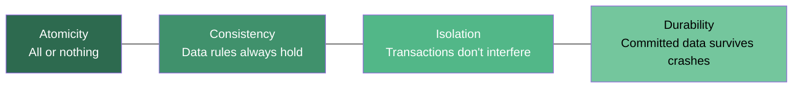
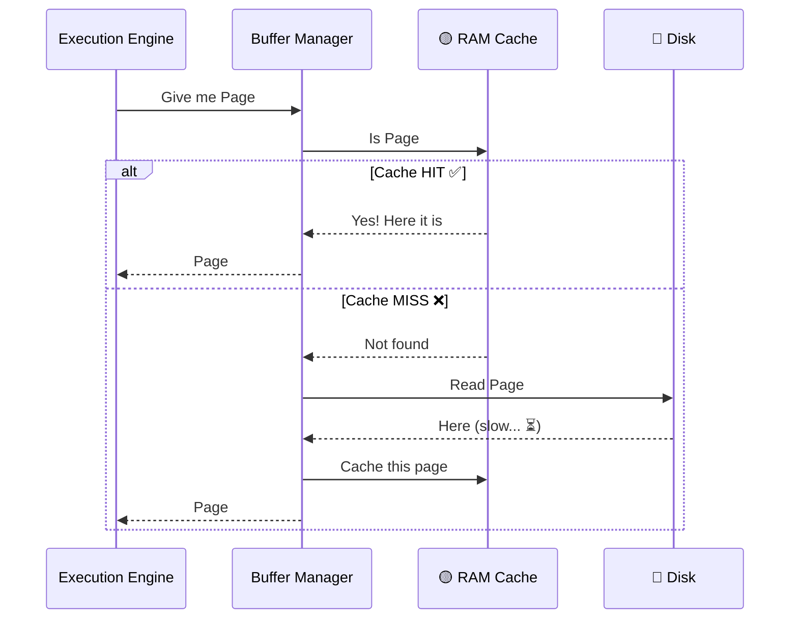
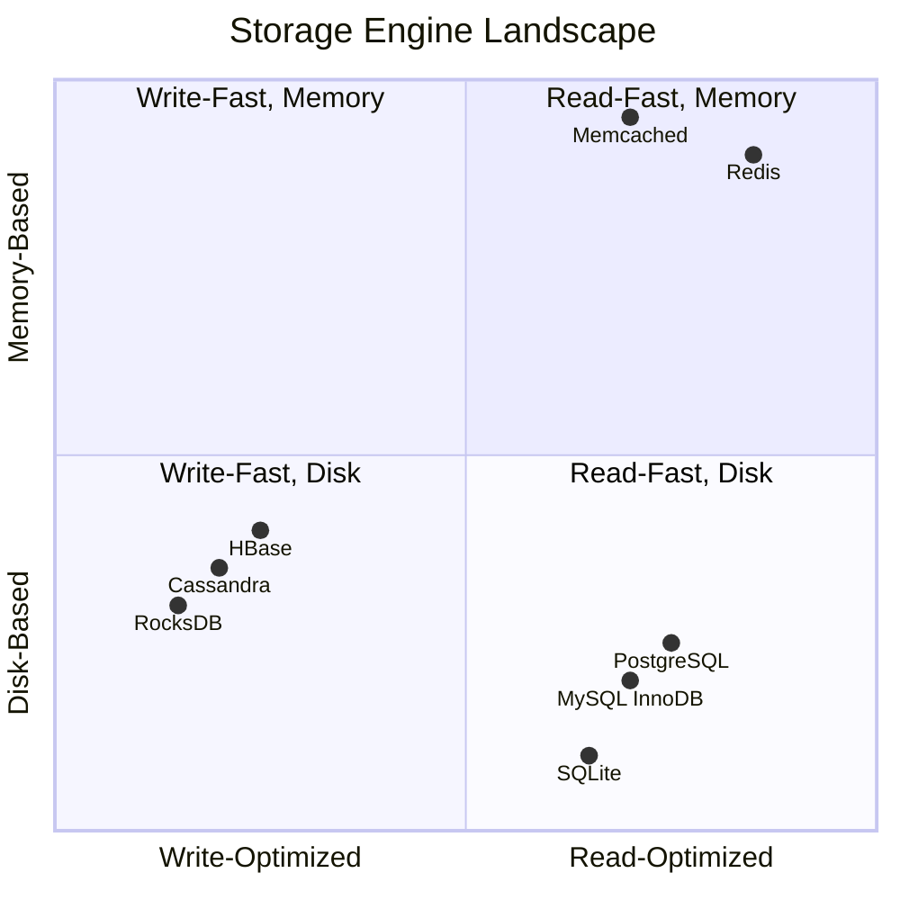
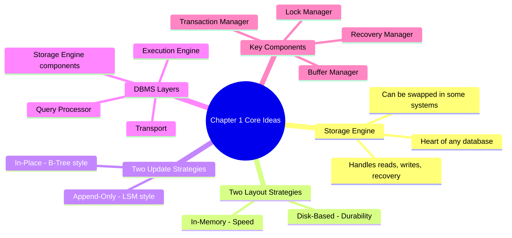

# 🔍 Chapter 1: Introduction and Overview of Storage Engines

> *"A database is just a fancy way to answer one question reliably, forever:  
'What did I store, and where is it?' Everything else is engineering."*

---

## The Problem That Started It All

Picture this: It's 1970. IBM researcher **Edgar F. Codd** publishes a paper titled *"A Relational Model of Data for Large Shared Data Banks."* Nobody in the building thinks it will change the world.

It did.

Fast forward 50+ years. You have thousands of databases to choose from — relational, document, columnar, time-series, graph, key-value. They all speak different languages. They all make different promises. And they all, under the hood, are trying to solve the **same fundamental problem**:

> **How do I store data on disk and get it back — fast, correctly, and reliably — even when the power goes out?**

Chapter 1 of *Database Internals* is where Alex Petrov sets the stage. No equations yet. No code. Just a beautiful overview of *why* storage engines exist, *how* they think, and *what* makes one different from another.

---

## 🧠 What Even IS a Storage Engine?

Think of a full database system like an iceberg:

The **storage engine** is everything below the query language. It is the module responsible for:

1. **Storing** data on disk in some organized layout
2. **Retrieving** data efficiently when asked
3. **Ensuring durability** — data survives crashes
4. **Enabling concurrency** — multiple users without chaos

> 💡 **Interesting Fact:** The word "database" was first used in the 1960s by the US military's System Development Corporation. Early databases had no query language — you literally had to know the exact memory address of your data. SQL was decades away.

---

## 🗂️ How Do We Classify Storage Engines?

Petrov introduces a crisp way to think about storage engines along **two key axes**:

### Axis 1: Storage Layout — Where does data live?

**In-memory** databases keep everything in RAM. Blazing fast. But expensive, and what happens when power goes out? (Hint: some use snapshots, write-ahead logs, or just accept the loss.)

**Disk-based** databases persist everything to disk. Slower than RAM by orders of magnitude — but durable. Your data is there tomorrow morning.

> 💡 **Interesting Fact:** RAM is roughly **100,000x faster** than a traditional spinning hard disk for random reads. Even modern SSDs are 10–100x slower than RAM. This gap is *the* central obsession of storage engine design.

---

### Axis 2: Update Strategy — How is data modified?

This is where it gets *really* interesting. Here are the two dominant philosophies:

**In-place update (mutable):** Find the record on disk. Overwrite it. Done. This is what B-Tree engines like PostgreSQL and InnoDB do. Think of it like using an **eraser** — you fix mistakes right where they are.

**Append-only (immutable):** Never touch existing data. Write new versions at the end. Clean up old data later through a process called *compaction*. This is what LSM-Tree engines like Cassandra and RocksDB do. Think of it like a **logbook** — you never erase, only add new entries.

> 🎯 *"Mutable databases erase their past. Immutable databases remember everything — and pay the cleanup bill later."*

---

## 🏗️ The Architecture of a DBMS

Let's zoom out and see the full picture of how a database management system (DBMS) is structured:

Let's understand each layer with a story:

### 🚌 Transport Layer — The Receptionist
Your query arrives at the database like a visitor arriving at an office. The **transport layer** is the receptionist — it handles the connection protocol (TCP, Unix sockets), authentication, and routes you to the right department.

### 🧠 Query Processor — The Strategist
The **query parser** reads your SQL and checks if it makes sense (syntax). Then the **optimizer** figures out the *best way* to execute it. Should it use an index? Should it join table A to B or B to A first? This is where a lot of magic happens.

> 💡 **Interesting Fact:** PostgreSQL's query optimizer considers thousands of possible execution plans and picks the cheapest one using statistics about your data. A single `SELECT` with 3 JOINs can have over **1,000 valid execution plans**. The optimizer considers them all in milliseconds.

### ⚙️ Execution Engine — The Worker
The execution engine *actually runs* the chosen plan. It calls into the storage engine for each row or page it needs. It's the hands-on laborer following the strategist's instructions.

### 🔐 Transaction Manager — The Accountant
Ensures that your operations follow ACID rules:

> 💡 **Interesting Fact:** The term **ACID** was coined by Andreas Reuter and Theo Harder in 1983. It took 13 years after Codd's relational model paper to even *name* these properties. They existed before they had a name — engineers just called them "making sure the database doesn't lie to you."

### 💾 Buffer Manager — The Bridge Between Two Worlds

This is one of the most critical and underappreciated components. Here's the fundamental problem:

- RAM holds gigabytes → millisecond access
- Disk holds terabytes → millisecond to second access
- You want terabyte capacity at RAM speed

The buffer manager is the bridge:

The art of the buffer manager is in deciding **which pages to keep in RAM** and **which to evict** when memory is full. This is the classic **cache eviction problem** — and algorithms like LRU (Least Recently Used) are the bread and butter of this layer.

### 📋 Recovery Manager — The Insurance Policy

Every single write operation gets recorded in a **Write-Ahead Log (WAL)** *before* it's applied to the actual data pages. This is the golden rule of database durability:

> *"Write to the log first. Always. No exceptions."*

If the server crashes mid-write, the recovery manager replays the log on restart and restores the database to a consistent state. It's like having a CCTV camera watching every transaction — even if the building burns down, the footage survives.

---

## 📊 Comparing Storage Engine Types

Let's put it all together in one clean comparison:

---

## 🤔 The DBMS vs Storage Engine Distinction

Here's a subtle but important point Petrov makes early on:

**A storage engine is NOT the same as a database.**

A storage engine is a *component* — it only knows how to read and write data structures on disk. A full DBMS wraps the storage engine with:
- A query language (SQL, etc.)
- Network protocols  
- Security and authentication
- Replication
- Monitoring

**RocksDB** is a storage engine. You can embed it in your application, but it has no SQL, no network layer, no users.

**MySQL** is a DBMS. It uses InnoDB (a storage engine) internally, but adds all the DBMS layers on top.

> 💡 **Interesting Fact:** **Facebook** built a database called **MyRocks** by replacing MySQL's InnoDB storage engine with RocksDB. They reduced storage costs by **50%** on their main user database — just by swapping the storage engine while keeping MySQL's SQL interface. That's the power of understanding internals.

---

## 🔑 Key Takeaways from Chapter 1

---

## 🧪 A Thought Experiment

Here's a scenario to test your new intuition:

**You're building a system that tracks stock prices — a new price tick arrives every millisecond. Users query historical prices occasionally.**

- Write frequency: **Very high** (1000 writes/sec)
- Read frequency: **Low** (occasional queries)
- Data loss tolerance: **Zero** (financial data)

*Which storage engine family would you choose?*

Think about it before reading on...

...

**Answer:** **LSM-Tree** (Cassandra, InfluxDB, TimescaleDB). Because:
- Writes are append-only → sequential disk I/O → handles 1000 writes/sec easily
- Reads are occasional → the overhead of checking multiple files is acceptable
- Durability is ensured via WAL even in append-only systems

> 🎯 *"The right database is not the most popular one.  
It's the one whose tradeoffs align with your problem.  
Chapter 1 gives you the map. The rest of the book teaches you to read it."*

---

## 🚀 What's Next: Chapter 2 — B-Tree Basics

In the next blog, we crack open the **B-Tree** — the most important data structure in databases, hiding inside almost every RDBMS you've ever used.

We'll explore:
- Why binary search trees fail at scale
- How B-Trees were invented to solve disk I/O problems
- The anatomy of a B-Tree node
- How search, insert, and delete work
- Why B-Trees are still relevant 50 years after their invention

*Spoiler: A B-Tree from 1970 is still beating newer alternatives in most read-heavy workloads. Sometimes the classics are classics for a reason.*

---

*Part of the **"Database Internals Explained"** blog series — making Alex Petrov's masterpiece accessible to every developer and educator.*

> 💬 **Discussion:** Have you ever had a production database slow down and not known why? Now that you know about buffer managers, WAL, and update strategies — what do you think the culprit might have been?

---
