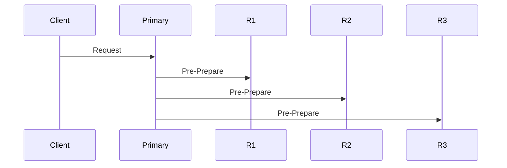
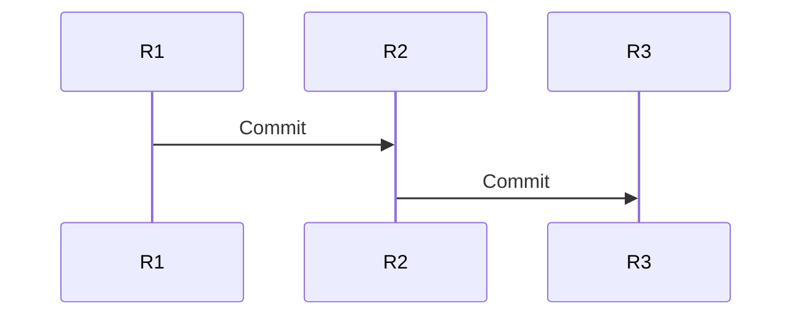

# 🚀 PBFT (Practical Byzantine Fault Tolerance) – सविस्तर समजून घेऊया

Byzantine fault म्हणजे काही nodes जाणीवपूर्वक चुकीचं वागू शकतात.
PBFT हा असा algorithm आहे जो अशा malicious nodes असतानाही system ला **consistent ठेवतो**.

---

# 1️⃣ PBFT का आवश्यक आहे?

Crash fault systems (Raft, Paxos) assume करतात:

> Node crash होईल, पण खोटं बोलणार नाही.

पण जर node:

* वेगवेगळ्या nodes ला वेगवेगळे messages पाठवतो
* Data modify करून पाठवतो
* Leader असूनही चुकीची value propose करतो

तर crash-based consensus पुरेसा नसतो.

इथे PBFT उपयोगी पडतो.

---

# 2️⃣ System Model

PBFT मध्ये:

* Total replicas = **3f + 1**
* f = faulty (malicious) replicas

### उदाहरण:

* 1 malicious tolerate करायचा → 4 nodes
* 2 malicious tolerate करायचा → 7 nodes

---

# 3️⃣ Roles

PBFT मध्ये दोन प्रकारचे replicas असतात:

* **Primary (Leader)**
* **Backup replicas**

Primary request sequence करतो.

---

# 4️⃣ PBFT Workflow – 3 Main Phases

समजा Client request पाठवतो:

> “Account A → B ला ₹100 transfer”

---

## 🔹 Phase 1: Pre-Prepare

1. Client → Primary ला request
2. Primary request ला sequence number देतो
3. Primary सर्व replicas ना **PRE-PREPARE** message पाठवतो

---

## 🔹 Phase 2: Prepare

Backup replicas:

* Message verify करतात
* Primary cheating करत नाही ना ते पाहतात
* मग सर्व replicas ना **PREPARE** message broadcast करतात

Replica ला पुढच्या phase ला जायचं असेल तर:

> 2f matching PREPARE messages मिळाले पाहिजेत

---

## 🔹 Phase 3: Commit

Replica ला:

> 2f + 1 matching COMMIT messages मिळाले → request execute

Commit झाल्यावर:

* Transaction apply
* Client ला reply

---

# 5️⃣ Message Count Condition

Replica request commit करतो जर:

* 1 PRE-PREPARE
* 2f PREPARE
* 2f + 1 COMMIT

मिळाले.

ही strict majority malicious influence रोखते.

---

# 6️⃣ Primary Malicious असेल तर?

उदा:

Primary R1 ला value=100 सांगतो
Primary R2 ला value=200 सांगतो

Backups:

* Prepare phase मध्ये mismatch detect करतात
* Request reject करतात
* **View Change** सुरू करतात

---

# 7️⃣ View Change (Leader Replacement)

Primary faulty वाटला तर:

* Replicas view number increment करतात
* नवीन primary निवडला जातो
* System पुढे चालू राहतो

---

# 8️⃣ PBFT Safety कसं राखतो?

### Safety Guarantee:

> दोन honest replicas वेगवेगळे values commit करणार नाहीत.

कारण commit साठी 2f+1 लागतात
आणि honest replicas किमान f+1 असतात.

---

# 9️⃣ Everyday Analogy

Imagine viva panel:

4 examiners:

* 1 examiner malicious आहे
* बाकी 3 honest

Marks final करण्यासाठी:

* किमान 3 examiners सहमत असले पाहिजेत

Malicious examiner result बदलू शकत नाही.

---

# 🔟 PBFT Performance

Pros:

* Byzantine tolerate करतो
* Finality strong आहे (no fork)

Cons:

* Message complexity O(n²)
* Large clusters साठी expensive
* Scalability limited

---

# 1️⃣1️⃣ PBFT कुठे वापरतात?

* Hyperledger Fabric
* Some permissioned blockchains
* High-security distributed systems

---

# 1️⃣2️⃣ Crash Consensus vs PBFT

| Feature        | Raft/Paxos | PBFT      |
| -------------- | ---------- | --------- |
| Fault          | Crash      | Malicious |
| Nodes Required | 2f + 1     | 3f + 1    |
| Message Cost   | Lower      | High      |
| Scalability    | High       | Limited   |

---

# 🎯 Final Summary

PBFT म्हणजे:

> “काही nodes जाणीवपूर्वक खोटं बोलले तरी majority honest nodes system ला योग्य ठेवतात.”

तीन मुख्य phases:

1. Pre-Prepare
2. Prepare
3. Commit

Strong quorum = Strong safety.

---

