# 🌳 Chapter 2 — B-Tree Basics: The Data Structure That Powers Almost Every Database You've Ever Used

> *"If databases were buildings, the B-Tree would be the steel framework hidden inside the walls. You never see it. But without it, everything collapses."*

---

## The Problem With Trees You Already Know

Let me tell you a story about a librarian.

Imagine a massive library with **4 billion books**. A binary search tree is like a librarian who organizes books into two piles — "smaller" and "larger" — at every step. Sounds smart, right?

But here's the catch: this librarian stores each book on a **different floor of the building**, connected only by narrow staircases. To find one book, you climb up and down **32 floors** — one staircase per comparison.

Now imagine every single staircase trip takes **10 milliseconds** because the floors are on disk, not in RAM.

32 trips × 10ms = **320ms just to find one record.**

In a database serving thousands of queries per second? That's catastrophic.

This is exactly the problem that **Rudolf Bayer** and **Edward McCreight** solved in **1971** when they invented the B-Tree.

> 💡 **Interesting Fact:** The "B" in B-Tree has never been officially explained by its inventors. Leading theories: it stands for "Bayer" (after Rudolf Bayer), "Boeing" (where they worked), "Balanced", or "Broad". The inventors themselves stayed deliberately silent about it — one of computer science's greatest unsolved mysteries!

---

## 🗺️ Chapter 2 Mind Map

```markmap
# B-Tree Basics

## Why Not Binary Search Trees?
- Low fanout (only 2 children)
- O(log₂ N) disk seeks = too many
- Random layout = poor locality
- Frequent rebalancing = expensive

## Disk Reality
### Hard Disk Drives (HDD)
- Mechanical head movement
- Sequential I/O >> Random I/O
- Smallest unit: sector (512B–4KB)
### Solid State Drives (SSD)
- No moving parts
- Pages: 2–16 KB
- Blocks: 64–512 pages
- Erase block limitation

## B-Tree Structure
### Node Types
- Root node (top, no parent)
- Internal nodes (navigation)
- Leaf nodes (actual data)
### Key Properties
- High fanout (N keys, N+1 pointers)
- Low height
- Sorted keys → binary search inside node
- Built bottom-up

## B⁺-Tree (what DBs actually use)
- Values only in leaf nodes
- Internal nodes = separator keys only
- Leaf nodes often doubly linked

## Algorithms
### Lookup
- Root → Internal → Leaf
- Binary search at each node
- O(log N) disk transfers

### Insert
- Locate leaf
- Append if space
- Split if overflow → promote key

### Delete
- Locate leaf, remove
- Merge if underflow ← demote key
- Rebalancing as optimization
```

---

## 🌲 Binary Search Trees: Brilliant in Memory, Broken on Disk

Before we appreciate B-Trees, we need to understand why their simpler cousins — **Binary Search Trees (BSTs)** — fail miserably as disk data structures.

A BST is elegant: every node has at most 2 children. Keys to the left are smaller; keys to the right are larger. Finding any element takes O(log₂ N) comparisons.

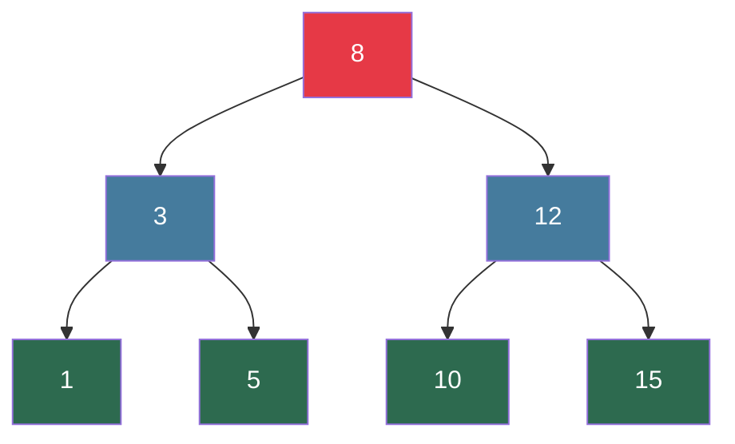

Beautiful. But here's the nightmare scenario — insert elements in sorted order:


Your balanced tree becomes a **linked list**. Complexity degrades from O(log N) to **O(N)**. For 1 million records, that's 1 million comparisons instead of 20.

### The Two Fatal Flaws for Disk Storage

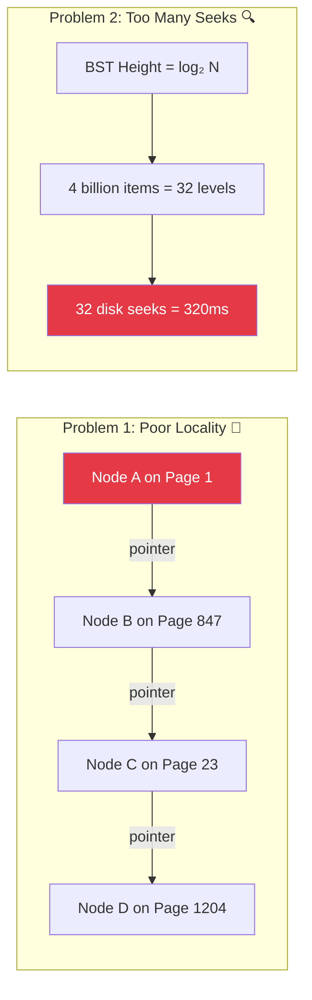

**Problem 1 — Poor locality:** BST nodes are written wherever memory is free. Node A's left child could be on a completely different disk page than Node A. Every pointer follow = potential disk seek.

**Problem 2 — Too many seeks:** With fanout of only 2, a BST with 4 billion items is **32 levels deep**. That's 32 disk seeks per lookup. At 10ms per seek = 320ms. Unacceptable.

The fix? We need a tree that is:
- **Wide, not tall** (high fanout → fewer levels → fewer disk seeks)
- **Locally packed** (many keys per node → one disk read = many keys examined)

> 💡 **Interesting Fact:** A BST with 1 billion records needs **~30 disk seeks**. A B-Tree with the same data and just 100 keys per node needs only **5 seeks**. That's a **6x reduction** in disk I/O — the difference between a 300ms query and a 50ms one.

---

## 💽 The Disk Reality: Why Hardware Shapes Data Structures

This is one of the most important — and most overlooked — insights in the book. **The data structure you choose must respect the hardware it runs on.**

### Hard Disk Drives (HDD): The Mechanical Monster

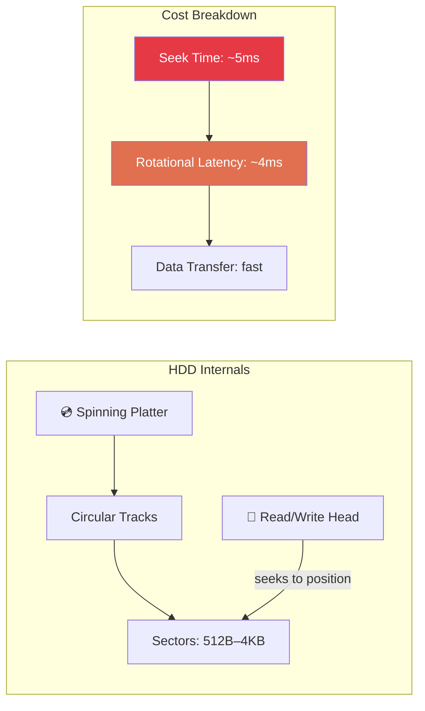

The HDD's mechanical head must **physically move** to the right track. This "seek time" is ~5ms — an eternity in computer time. Sequential reads (no head movement) are dramatically faster. This is why **sequential I/O >> random I/O** on spinning disks.

### Solid State Drives (SSD): Better, But Still Block-Based

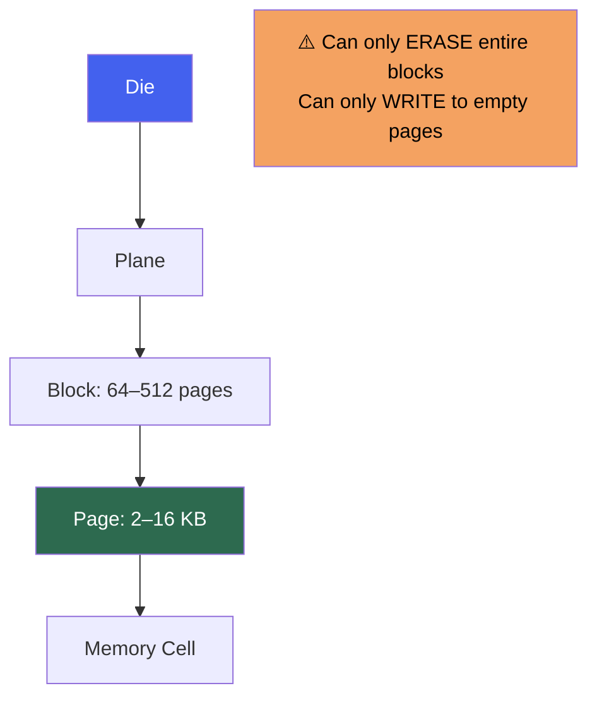

SSDs are faster and have no moving parts. But they have a crucial constraint: **you can only erase at the block level** (64–512 pages at once), even if you want to update just one byte. This is why LSM-Trees (which avoid in-place updates entirely) are SSD-friendly.

### The Universal Truth

Both HDD and SSD operate on **blocks**, not bytes. When you read one byte, you fetch an entire block (4–16 KB). This means:

> **The unit of disk I/O is the page. Design your data structures around this fact.**

B-Trees are built exactly for this: **one node = one page**. One disk read → one node → dozens of keys examined. Genius.

---

## 🌳 Enter the B-Tree: Wide, Balanced, and Disk-Aware

B-Trees solve both BST problems elegantly:

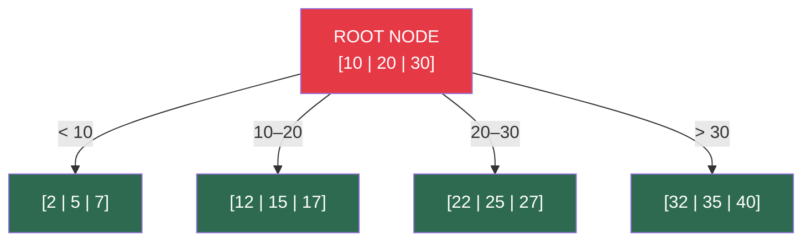

Notice the difference:
- **One root node** holds multiple keys — not just one
- **4 children** from just 3 separator keys (fanout = 4)
- **All data at the same level** (balanced by design)
- Each node fits in **one disk page**

### B-Tree Node Anatomy

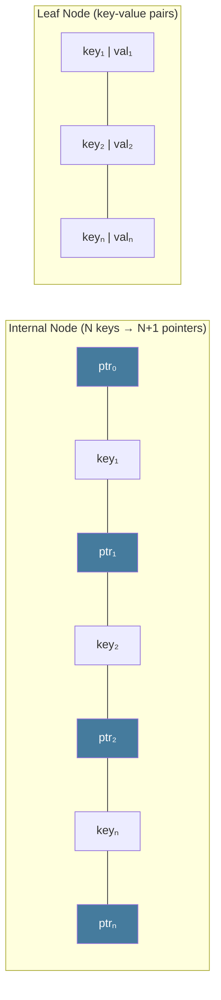

- **Internal nodes** store separator keys + pointers to children
- **Leaf nodes** store actual key-value data
- Keys inside a node are **sorted** → binary search is possible within each node

### The Fanout Superpower

Here's the math that makes B-Trees magical:

| Tree Type | Fanout | Height for 1 Billion Records | Disk Seeks |
|-----------|--------|------------------------------|------------|
| Binary Search Tree | 2 | ~30 levels | ~30 seeks |
| 2-3 Tree | 3 | ~19 levels | ~19 seeks |
| B-Tree (100 keys/node) | 100 | ~5 levels | ~5 seeks |
| B-Tree (1000 keys/node) | 1000 | ~3 levels | ~3 seeks |

> 🎯 **Punchline:** *"Increasing fanout from 2 to 1000 turns a 300ms query into a 30ms one. That's not an optimization. That's a different universe."*

---

## B⁺-Trees: What Databases Actually Use

Here's a subtle but critical distinction the book makes:

The **B-Tree** (original) stores values at any level — root, internal, or leaf.

The **B⁺-Tree** stores values **only at leaf nodes**. Internal nodes hold only separator keys for navigation.

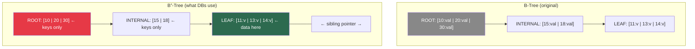

Why does B⁺-Tree win?
1. **Denser internal nodes** → more keys per page → even lower tree height
2. **All data on one level** → range scans are just a leaf-level linked list traversal
3. **Simpler algorithms** → splits and merges only propagate key copies upward, never values

> 💡 **Interesting Fact:** MySQL's InnoDB documentation literally calls its B⁺-Tree implementation a "B-tree" — because the B⁺-Tree variant became so dominant that the distinction was dropped. When anyone says "B-Tree in a database", they almost certainly mean B⁺-Tree.

### Separator Keys: The Navigation System

Inside each internal node, keys act as **road signs** splitting the universe into subtrees:

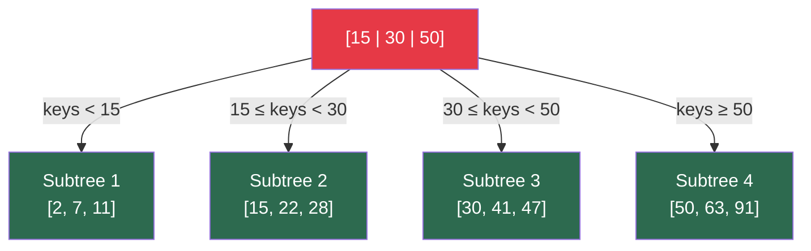

N separator keys → N+1 child pointers. Clean, predictable, efficient.

---

## 🔍 B-Tree Lookup: A Root-to-Leaf Journey

Finding a key in a B-Tree is a single traversal from root to the target leaf. Think of it as progressively **zooming in on a map**:

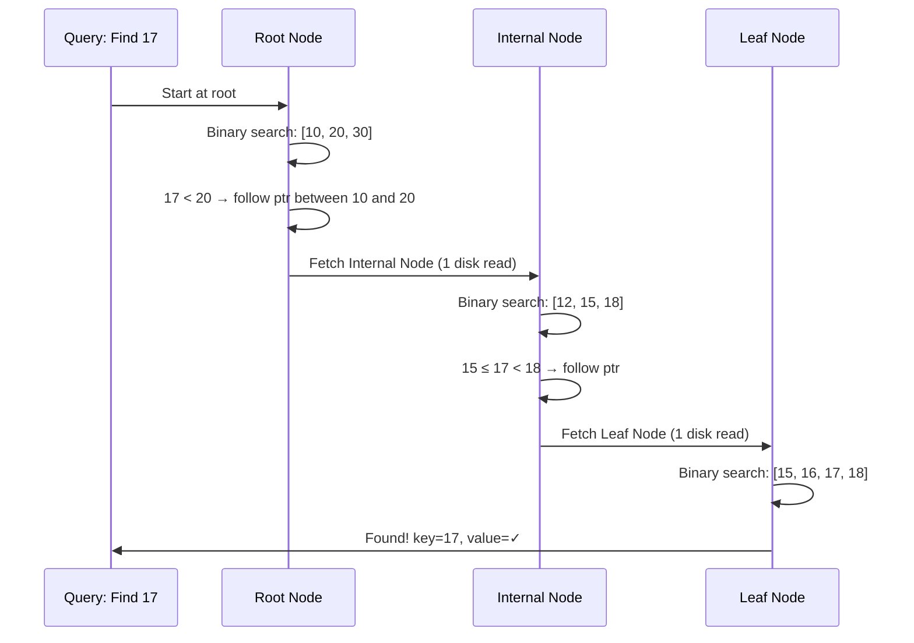

**Total disk reads: 3** (one per level). For a billion records with 1000 keys/node, that's still just **3 reads**.

For **range queries** like `WHERE age BETWEEN 20 AND 30`:
1. Find the leaf with key=20
2. Follow the **sibling pointer** to the next leaf
3. Keep scanning until key > 30

The linked leaf layer makes range scans blazing fast — no need to go back up the tree.

---

## ✂️ B-Tree Node Splits: When a Node Gets Too Full

Here's where the magic (and complexity) of B-Trees lives. What happens when you insert into a full node?

**The node splits.** Half the keys go left, half go right, and one key gets **promoted** to the parent.

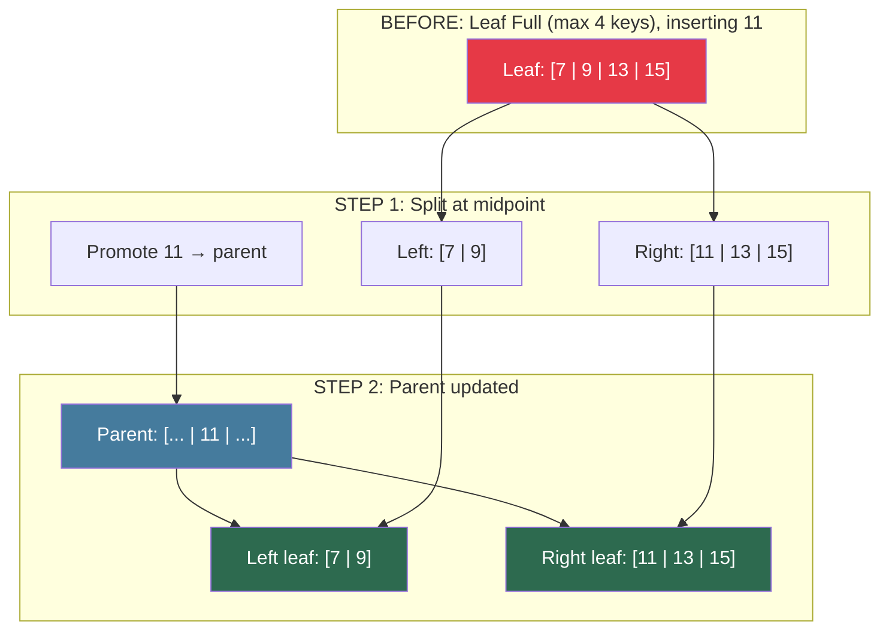

### Split Cascade: When the Parent is Also Full

Splits can **propagate upward** recursively:

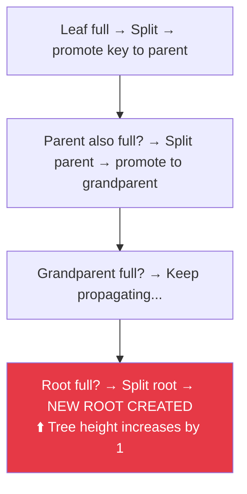

> 💡 **Interesting Fact:** B-Trees grow from the **bottom up**, not top down. The tree height only increases when the **root splits**. Regular insertions grow the tree horizontally (adding more leaves), never vertically. This means most insertions *never* change the tree height.

**4 steps of a split:**
1. Allocate a new node
2. Copy half the elements to the new node
3. Place the new element in the correct node
4. Add separator key + pointer to the parent

---

## 🗑️ B-Tree Node Merges: When a Node Gets Too Empty

Deletions are the mirror image. Remove a key from a leaf. If the leaf becomes **too sparse** (underflow), it merges with its sibling.

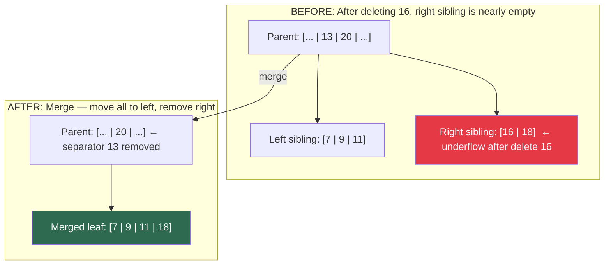

**3 steps of a merge:**
1. Copy all elements from right node to left node
2. Remove the right node pointer from parent (demote separator key for internal merges)
3. Delete the right node

Just like splits, merges can **cascade upward** to the root.

> 🎯 **Punchline:** *"B-Tree splits are a tree saying 'I'm too popular'. Merges are a tree saying 'I need company'. Both are the tree keeping itself honest."*

---

## 🔑 Why B-Trees Are Still Dominant After 50+ Years

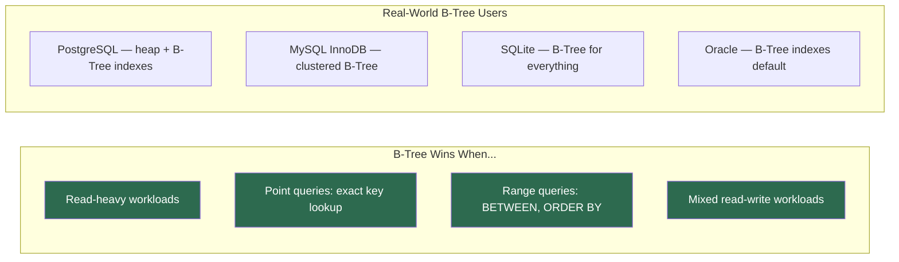

B-Trees have survived because they hit the sweet spot: good at reads, acceptable at writes, excellent at range scans, and predictable performance. The storage engine designer's "safe default".

> 💡 **Interesting Fact:** PostgreSQL uses B-Trees for **all default indexes** — primary keys, unique constraints, and regular indexes. A typical PostgreSQL table with a million rows has a B-Tree index just **3–4 levels deep**. That's 3–4 disk reads to find any record, regardless of table size.

---

## 🧪 Thought Experiment: Design Your Own B-Tree Node

You're designing a B-Tree for a user database. Each user record is 200 bytes. Your disk page is 8 KB (8192 bytes). Separator keys are 8 bytes. Child pointers are 8 bytes.

**How many keys fit per internal node?**

```
Node size = 8192 bytes
Per key-pointer pair = 8 + 8 = 16 bytes
Plus one extra pointer = 8 bytes
Keys per node ≈ (8192 - 8) / 16 ≈ 511 keys
```

**Tree height for 1 billion records:**
```
log₅₁₁(1,000,000,000) ≈ log(10⁹) / log(511) ≈ 3.27 → 4 levels
```

**4 disk reads** to find any of 1 billion records. Let that sink in.

---

## 📊 Chapter 2 Summary

```mermaid
mindmap
  root((B-Tree Takeaways))
    BST Problems on Disk
      Low fanout = too many levels
      Poor locality = too many seeks
      Frequent rebalancing = expensive
    Disk Properties Matter
      HDD: sequential >> random
      SSD: block-erase constraint
      Unit is page not byte
    B-Tree Solutions
      High fanout = few levels
      One node = one disk page
      Keys sorted = binary search in node
    B+-Tree Refinement
      Values only at leaves
      Internal = navigation only
      Leaf siblings linked for range scans
    Core Operations
      Lookup: root to leaf, O(log N) seeks
      Insert: find leaf, append, split if full
      Delete: find leaf, remove, merge if sparse
```

---

## 🚀 What's Next: Blog 3 — File Formats

We know *what* B-Trees look like logically. But **how do you actually lay out a B-Tree node on disk?**

In Blog 3, we'll explore:
- Binary encoding of keys and values
- Fixed-size vs variable-size records
- Slotted page design (the standard technique used by PostgreSQL, SQLite, and others)
- How page headers work
- Big-endian vs little-endian and why it matters for databases

*Spoiler: A PostgreSQL page is 8 KB of very carefully arranged bytes. After Blog 3, you'll be able to read it.*

---

*Part of the **"Database Internals Explained"** blog series — making Alex Petrov's masterpiece accessible to every developer and educator.*

> 💬 **Discussion:** PostgreSQL uses B-Trees for all default indexes, while Cassandra uses LSM-Trees. If you had to pick a database for an **e-commerce order system** (heavy reads, moderate writes, lots of ORDER BY queries) — which approach would you choose and why?
