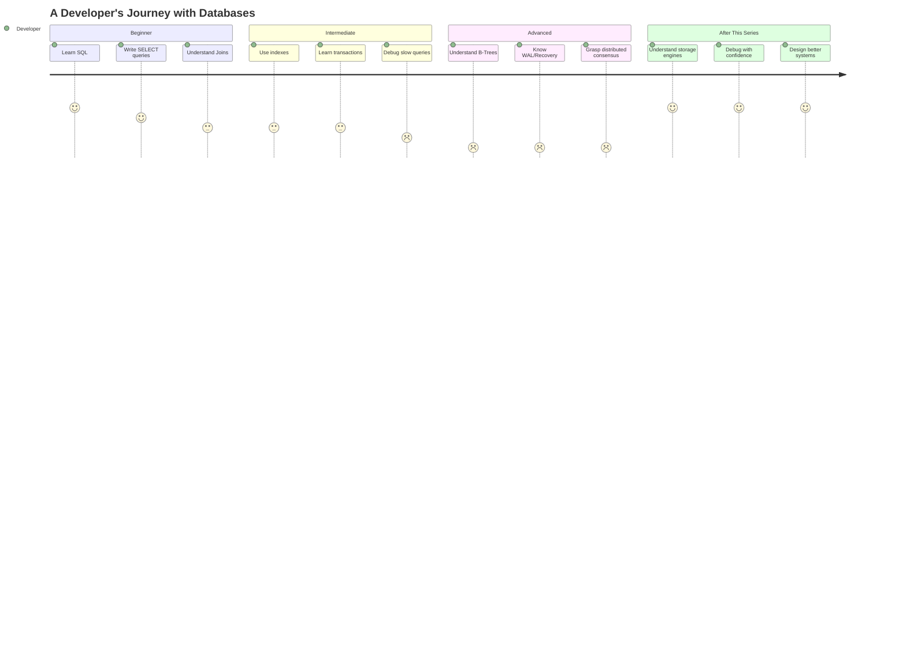
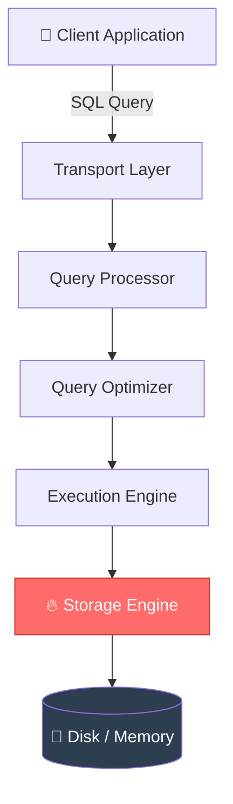

# What's Really Inside a Database? — A Teacher's Journey
### *Database Internals Series : Why This Book Will Change How You See Databases Forever*

---

I taught databases for over 10 years.  
I thought I knew them well.  
Then I started reading this book —  
and realized I had only ever seen the door, never seen what was inside it.*

---

## 🎓 The Classroom That Started It All

Picture a classroom in an engineering college.  
Rows of students, notebooks open, ceiling fans humming.  
On the blackboard: **ER Diagrams. Normalization. SQL Joins.**

For more than a decade, I stood at that board.  
I explained primary keys, foreign keys, ACID properties, and transaction isolation.  
I drew beautiful ER diagrams and walked students through normalization —  
1NF, 2NF, 3NF, BCNF —  
like a monk reciting scripture.

But there was always a question that nagged at the back of my mind —  
a question that none of the standard textbooks quite answered:

> **When I type `SELECT * FROM orders WHERE id = 42` — what *actually* happens inside the database?**

Sure, I knew about indexes.  
I knew about B-Trees at a conceptual level.  
But *how* does a B-Tree live on disk?  
*How* does a database crash and come back with data intact?  
*How* do distributed databases like Cassandra or MongoDB manage to store data across hundreds of machines without losing a single byte?

The textbooks gave me *what*.  
I was hungry for *how* and *why*.

Then, one day, I picked up **"Database Internals" by Alex Petrov** — and the lights came on.

---

## 📖 The Book That Opened the Black Box

```markmap
# Database Internals — The Big Picture

## Part I: Storage Engines
### How data lives on ONE machine
- DBMS Architecture
- Memory vs Disk-Based Storage
- Row vs Column Oriented Layout
- B-Trees — The Heart of Databases
- File Formats & Binary Encoding
- Transaction Processing & Recovery
- B-Tree Variants (LMDB, WiredTiger...)
- Log-Structured Storage (LSM Trees)

## Part II: Distributed Systems
### How data lives across MANY machines
- Failure Detection
- Leader Election
- Replication & Consistency
- Anti-Entropy & Gossip
- Distributed Transactions
- Consensus Algorithms (Paxos, Raft, ZAB)
```

Alex Petrov didn't write a textbook.  
He wrote a **treasure map** —  
one that leads you through the hidden corridors of databases that no college course ever shows you.

The book is split into two powerful parts:
- **Part I** answers: *How does a single database node store and retrieve data efficiently?*
- **Part II** answers: *How do multiple nodes work together without chaos?*

---

## 🤯 5 Facts

Before we dive in, here are five facts from the world of database internals that will make you look at your next `INSERT` statement with completely different eyes:

> 💡 **Fact #1:** A single **B+ Tree** lookup in a database with **1 billion records** takes only **3 or 4 disk reads** — because B+ Trees are wide and shallow, with thousands of keys per node.

> 💡 **Fact #2:** InnoDB (MySQL's default engine), PostgreSQL, SQLite, and even MongoDB's WiredTiger — they all use **B-Trees** at their core. One data structure rules them all.

> 💡 **Fact #3:** When a database crashes mid-write, it doesn't "remember" what it was doing. It uses a **Write-Ahead Log (WAL)** — essentially a diary written *before* any actual work — to replay and recover. Like a chef writing the recipe before cooking.

> 💡 **Fact #4:** Amazon's 2007 **Dynamo paper** — just one research paper — inspired Cassandra (Facebook), Riak (Akamai), and Voldemort (LinkedIn). One idea. Three giants.

> 💡 **Fact #5:** The consensus problem in distributed systems — getting multiple computers to *agree* on one value — was **mathematically proven to be impossible** under certain conditions (FLP Impossibility, 1985). Yet every distributed database solves it in practice. Welcome to the beautiful paradox.

---

## 🗺️ Why This Series Exists



Most developers spend their entire careers in the **Beginner → Intermediate** zone.  
They use databases as black boxes.  
They optimize queries when things get slow.  
They restart the server when things break.

That's fine — until it isn't.

Until the database is **losing data** and you don't know why.  
Until your **system design interview** asks you why Cassandra is eventually consistent.  
Until your **production system crashes** and you're staring at cryptic WAL recovery logs at 2 AM.  

**This series is your flashlight for those dark moments.**

---

## 🏗️ What Is a Database, Really?

We use the word "database" casually.  
But a database management system (DBMS) is actually a beautifully layered machine:



The **Storage Engine** is the beating heart —  
the component responsible for *actually* reading and writing data. Everything else is orchestration.

And this is what most books skip entirely.  
They talk about the top three layers.  
Alex Petrov's book dives straight into **layer 6** —  
the storage engine — and goes even deeper.

---

## 🧱 The Two Big Questions of Every Database

Every database system ever built is trying to answer just two questions:

```markmap
# Database's Core Problem

## How to STORE data?
### On disk or in memory?
### Row-by-row or column-by-column?
### Which data structure?
- B+ Trees
- LSM Trees
- Hash Tables
### How to handle crashes?

## How to DISTRIBUTE data?
### Across multiple machines?
### How to stay consistent?
### What if a machine fails?
### How to agree on one truth?
- Paxos
- Raft
- ZAB
```

**That's it.**  
Every design decision, every trade-off, every algorithm in a database —  
from PostgreSQL to Cassandra to Google Spanner —  
is an answer to one of these two questions.

This book covers both, deeply, honestly, with real algorithms and real systems.

---

## 👨‍🏫 Why Every Faculty Member Should Read This Book

I say this as someone who taught databases for over 10 years:

> **We have been teaching students *how to use* databases. This book teaches *how databases work*.**

There is a profound difference.

When you understand internals, your teaching transforms:
- You stop saying *"B-Trees are used for indexing"* and start explaining *why* B-Trees are optimized for disk, not for RAM
- You stop saying *"Transactions ensure ACID"* and start explaining *how* WAL and recovery actually enforce Durability
- You stop saying *"Distributed databases are eventually consistent"* and start explaining *why* the CAP theorem forces that choice

Your students will ask better questions.  
Their system design will improve.  
Their debugging instincts will sharpen.

This book is the upgrade every CS/IT faculty member's mental model needs.

---

## 💻 Why Every Developer Should Read This Book


Here's when this knowledge pays off in real life:

| Situation | Without Internals | With Internals |
|---|---|---|
| Slow query | Add an index, pray | Understand B-Tree traversal, fix root cause |
| Database crash | Restart and hope | Read WAL logs, understand recovery |
| Choosing a DB | Check StackOverflow | Compare storage engines with reasoning |
| System design interview | Recite buzzwords | Explain trade-offs with depth |
| Data corruption | Panic | Understand concurrency control and fix |

---

## 🗺️ The Series Roadmap

Here's where we're going together:

```mermaid
flowchart TD
    B0("📌 Blog 0 — You Are Here<br>Introduction to the Series"):::done

    B0 --> P1

    subgraph P1["⚙️ Part I — Storage Engines (Single Node)"]
        direction TB
        B1("Blog 1 — Introduction & Overview<br>DBMS Architecture, Row vs Column, Index Files")
        B2("Blog 2 — B-Tree Basics<br>Binary Search Trees → Disk-Optimized B+ Trees")
        B3("Blog 3 — File Formats<br>Binary Encoding, Slotted Pages, Cell Layout")
        B4("Blog 4 — Implementing B-Trees<br>Splits, Merges, Page Headers, Bulk Loading")
        B5("Blog 5 — Transactions & Recovery<br>WAL, Buffer Management, ARIES, Isolation")
        B6("Blog 6 — B-Tree Variants<br>LMDB, WiredTiger, Bw-Trees, Lazy B-Trees")
        B7("Blog 7 — Log-Structured Storage<br>LSM Trees, SSTables, Bloom Filters, Compaction")
        B1 --> B2 --> B3 --> B4 --> B5 --> B6 --> B7
    end

    B7 --> P2

    subgraph P2["🌐 Part II — Distributed Systems (Multiple Nodes)"]
        direction TB
        B8("Blog 8 — Distributed Systems Intro<br>Fallacies, Clocks, Failure Models, FLP Impossibility")
        B9("Blog 9 — Failure Detection<br>Heartbeats, Phi-Accrual, Gossip")
        B10("Blog 10 — Leader Election<br>Bully, Ring, Raft Leader")
        B11("Blog 11 — Replication & Consistency<br>CAP, Linearizability, Eventual Consistency")
        B12("Blog 12 — Anti-Entropy & Gossip<br>Merkle Trees, Hinted Handoff, Read Repair")
        B13("Blog 13 — Distributed Transactions<br>2PC, 3PC, Spanner, Percolator, Calvin")
        B14("Blog 14 — Consensus<br>Paxos, Multi-Paxos, Raft, PBFT, ZAB")
        B8 --> B9 --> B10 --> B11 --> B12 --> B13 --> B14
    end

    classDef done fill:#27ae60,color:#fff,stroke:#1e8449
```



---

## 🎯 Who Is This Series For?

```markmap
# Target Readers

## Developers
### Junior Developers
- Curious about what happens behind SQL
- Want to ace system design interviews
### Senior Developers
- Want to choose databases wisely
- Debug production issues with confidence
### Architects
- Need to understand distributed trade-offs
- Design systems that don't fail

## Educators / Faculty
### CS/IT Professors
- Teach database internals with depth
- Go beyond syllabus textbooks
### Curriculum Designers
- Add modern storage engine concepts
- Include distributed systems theory

## Curious Learners
### Students
- Going beyond university syllabus
- Preparing for top tech interviews
### Tech Enthusiasts
- Just love understanding how things work
- The people who read manuals for fun
```

---

## 🚀 The Promise of This Series

Alex Petrov spent years studying **300+ research papers**, 15+ books, countless blog posts,  
and open-source codebases to write this book.  
He distilled it into ~350 pages.

I'm going to distill *that* —  
into digestible, visual, story-driven blogs —  
so that whether you're a student, a developer, or a professor,  
you can understand how the databases you use every day *actually work*.

Because you deserve to know what's inside the black box.

> **"It is usually much better to use a database that slowly saves the data than one that quickly loses it."**
> — Alex Petrov, Database Internals

---

## ⏭️ What's Next?

**Next blog** dives into **Chapter 1: Introduction and Overview** — where we'll explore:
- Why some databases store data in memory and others on disk
- Why row-oriented databases (MySQL) and column-oriented databases (Redshift) exist side by side
- How data files and index files are different
- The three forces that shape every storage engine: **Buffering, Immutability, and Ordering**

*Spoiler: Your database is making thousands of micro-decisions every second — and most developers never know it.*

---

*📌 This series is based on "Database Internals: A Deep Dive into How Distributed Data Systems Work" by Alex Petrov (O'Reilly, 2019). All concepts are explained in the author's own interpretation for educational purposes.*

*🙏 If this resonated with you — share it with a developer friend, a student, or a faculty colleague. Good knowledge deserves good company.*

---
