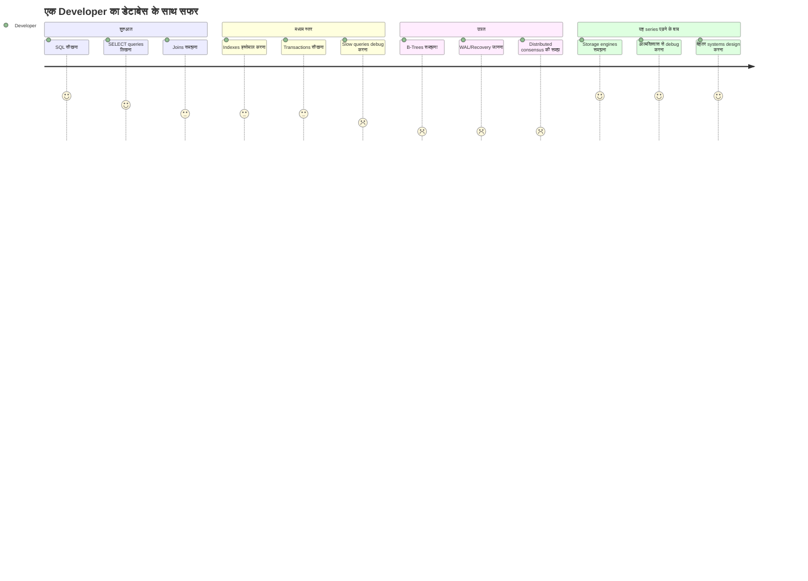
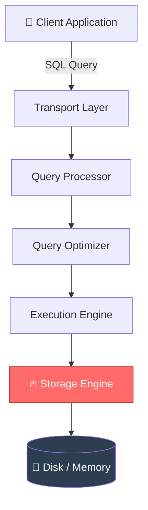

# डेटाबेस के अंदर क्या होता है? — एक शिक्षक का सफर
### *Database Internals Series : यह किताब डेटाबेस को देखने का आपका नज़रिया बदल देगी*

---

मैंने दस साल से भी ज़्यादा समय तक डेटाबेस पढ़ाया।  
मुझे लगता था — मुझे सब पता है।  
फिर यह किताब पढ़ी —  
और एहसास हुआ कि मैंने सिर्फ दरवाज़ा देखा था, अंदर कभी झाँका ही नहीं था।*

---

## 🎓 वह क्लासरूम जहाँ से सब शुरू हुआ

एक इंजीनियरिंग कॉलेज का क्लासरूम सामने लाइए।  
कतारों में बैठे छात्र, खुली कॉपियाँ, ऊपर घूमते पंखे।  
ब्लैकबोर्ड पर लिखा है: **ER Diagrams. Normalization. SQL Joins.**

दस साल से भी ज़्यादा समय तक मैं उस बोर्ड के सामने खड़ा रहा।  
Primary key, Foreign key, ACID properties, Transaction isolation —  
सब समझाया।  
1NF, 2NF, 3NF, BCNF —  
जैसे कोई साधु मंत्र पढ़ रहा हो।

लेकिन मन के किसी कोने में एक सवाल हमेशा कचोटता रहा —  
जिसका जवाब किसी पाठ्यपुस्तक ने ठीक से नहीं दिया:

> **जब मैं `SELECT * FROM orders WHERE id = 42` टाइप करता हूँ — तो डेटाबेस के अंदर असल में क्या होता है?**

Index के बारे में पता था।  
B-Tree की अवधारणा समझ में आती थी।  
लेकिन *B-Tree disk पर रहता कैसे है?*  
*Database crash होकर वापस आने पर data सुरक्षित कैसे रहता है?*  
*Cassandra या MongoDB सैकड़ों machines पर data रखते हैं — और एक byte भी नहीं खोती — यह कैसे मुमकिन है?*

पाठ्यपुस्तकें मुझे *क्या* बताती थीं।  
मुझे *कैसे* और *क्यों* जानना था।

एक दिन **Alex Petrov की "Database Internals"** हाथ में आई — और जैसे रोशनी हो गई।

---

## 📖 वह किताब जिसने Black Box खोला

```markmap
# Database Internals — बड़ी तस्वीर

## Part I: Storage Engines
### एक ही machine पर data कैसे जीता है
- DBMS Architecture
- Memory vs Disk-Based Storage
- Row vs Column Oriented Layout
- B-Trees — डेटाबेस का दिल
- File Formats & Binary Encoding
- Transaction Processing & Recovery
- B-Tree Variants (LMDB, WiredTiger...)
- Log-Structured Storage (LSM Trees)

## Part II: Distributed Systems
### कई machines पर data कैसे जीता है
- Failure Detection
- Leader Election
- Replication & Consistency
- Anti-Entropy & Gossip
- Distributed Transactions
- Consensus Algorithms (Paxos, Raft, ZAB)
```

Alex Petrov ने पाठ्यपुस्तक नहीं लिखी।  
उन्होंने एक **खज़ाने का नक्शा** लिखा —  
जो आपको डेटाबेस के उन छिपे हुए गलियारों में ले जाता है  
जो किसी कॉलेज के पाठ्यक्रम ने कभी नहीं दिखाए।

किताब के दो शक्तिशाली हिस्से हैं:
- **Part I** जवाब देता है: *एक अकेला database node data को कुशलता से कैसे store और retrieve करता है?*
- **Part II** जवाब देता है: *कई nodes मिलकर बिना अराजकता के कैसे काम करते हैं?*

---

## 🤯 ५ चौंका देने वाले तथ्य

आगे बढ़ने से पहले, database internals की दुनिया के ये पाँच तथ्य पढ़िए —  
अगली बार `INSERT` statement लिखते वक्त सोचने पर मजबूर कर देंगे:

> 💡 **तथ्य #1:** **B+ Tree** lookup में **१ अरब records** वाले database में सिर्फ **३ से ४ disk reads** लगते हैं — क्योंकि B+ Trees चौड़े और उथले होते हैं, हर node में हज़ारों keys होती हैं।

> 💡 **तथ्य #2:** InnoDB (MySQL का default engine), PostgreSQL, SQLite, और MongoDB का WiredTiger — ये सब **B-Trees** इस्तेमाल करते हैं। एक ही data structure सबपर राज करता है।

> 💡 **तथ्य #3:** Database crash होने पर उसे "याद" नहीं रहता कि वह क्या कर रहा था। वह **Write-Ahead Log (WAL)** इस्तेमाल करता है — यानी काम शुरू करने से पहले लिखी गई डायरी — और उसी से सब कुछ वापस लाता है। जैसे कोई रसोइया खाना बनाने से पहले रेसिपी लिख लेता है।

> 💡 **तथ्य #4:** Amazon का २००७ का **Dynamo paper** — सिर्फ एक शोधपत्र ने — Cassandra (Facebook), Riak (Akamai), और Voldemort (LinkedIn) को जन्म दिया। एक विचार। तीन दिग्गज।

> 💡 **तथ्य #5:** Distributed systems में consensus problem — कई computers को एक मूल्य पर *सहमत* कराना — गणितीय रूप से कुछ परिस्थितियों में **असंभव साबित हो चुका है** (FLP Impossibility, 1985)। फिर भी हर distributed database इसे व्यवहार में हल करता है। इस खूबसूरत विरोधाभास का स्वागत है।

---

## 🗺️ यह series क्यों शुरू की



ज़्यादातर developers अपना पूरा करियर **शुरुआत → मध्यम स्तर** में ही बिता देते हैं।  
वे databases को black box की तरह इस्तेमाल करते हैं।  
कुछ slow हो जाए तो index लगाते हैं।  
कुछ टूट जाए तो server restart करते हैं।

यह ठीक है — जब तक काम चलता रहे।

जब database **data खो देता है** और कारण समझ नहीं आता — तब नहीं चलता।  
जब **system design interview** में पूछा जाए कि Cassandra eventually consistent क्यों है — तब नहीं चलता।  
जब **production system crash** हो जाए और रात के २ बजे WAL recovery logs घूरनी पड़ें — तब नहीं चलता।

**यह series उन्हीं अंधेरे पलों के लिए आपकी टॉर्च है।**

---

## 🏗️ डेटाबेस असल में होता क्या है?

हम "database" शब्द बड़ी आसानी से इस्तेमाल करते हैं।  
लेकिन एक database management system (DBMS) दरअसल एक खूबसूरत परतों में सजी मशीन है:



**Storage Engine** वह धड़कता दिल है —  
जो असल में data पढ़ता और लिखता है। बाकी सब उसका प्रबंधन है।

और यही वह हिस्सा है जिसे ज़्यादातर किताबें छोड़ देती हैं।  
वे ऊपर की तीन layers के बारे में बात करती हैं।  
Alex Petrov की किताब सीधे **layer 6** — storage engine — में उतरती है, और उससे भी गहरे जाती है।

---

## 🧱 हर डेटाबेस के दो बुनियादी सवाल

आज तक बना हर database system सिर्फ दो सवालों के जवाब देने की कोशिश करता है:

```markmap
# डेटाबेस की मूल समस्या

## Data कैसे store करें?
### Disk पर या memory में?
### Row-by-row या column-by-column?
### कौन सी data structure?
- B+ Trees
- LSM Trees
- Hash Tables
### Crash होने पर क्या करें?

## Data कैसे distribute करें?
### कई machines पर कैसे?
### Consistent कैसे रखें?
### कोई machine बंद हो जाए तो?
### एक ही सच पर कैसे सहमत हों?
- Paxos
- Raft
- ZAB
```

**बस इतना ही।**  
PostgreSQL से Cassandra तक, Google Spanner तक —  
हर design फैसला, हर trade-off, हर algorithm  
इन्हीं दो सवालों में से किसी एक का जवाब है।

यह किताब दोनों को गहराई से, ईमानदारी से, असली algorithms और असली systems के साथ समझाती है।

---

## 👨‍🏫 हर faculty member को यह किताब क्यों पढ़नी चाहिए

दस साल से भी ज़्यादा समय तक databases पढ़ाने वाले के तौर पर कहता हूँ:

> **हम छात्रों को databases *कैसे इस्तेमाल करें* यह सिखाते हैं। यह किताब सिखाती है कि databases *कैसे काम करते हैं*।**

इसमें बड़ा फर्क है।

जब आपको internals समझ आते हैं, तो पढ़ाना बदल जाता है:
- *"B-Trees indexing के लिए इस्तेमाल होते हैं"* कहना छोड़कर बता सकते हैं कि *B-Trees disk के लिए optimize क्यों हैं, RAM के लिए नहीं*
- *"Transactions ACID ensure करते हैं"* कहना छोड़कर बता सकते हैं कि *WAL और recovery Durability कैसे enforce करते हैं*
- *"Distributed databases eventually consistent होते हैं"* कहना छोड़कर बता सकते हैं कि *CAP theorem इस चुनाव को मजबूर क्यों करता है*

आपके छात्र बेहतर सवाल पूछेंगे।  
उनका system design सुधरेगा।  
उनकी debugging की सहज समझ तेज़ होगी।

यह किताब हर CS/IT faculty member की सोच को चाहिए वह upgrade है।

---

## 💻 हर developer को यह किताब क्यों पढ़नी चाहिए


यह ज्ञान असल ज़िंदगी में कब काम आता है:

| परिस्थिति | Internals पता न हो तो | Internals पता हो तो |
|---|---|---|
| Slow query | Index लगाओ, दुआ करो | B-Tree traversal समझकर जड़ से ठीक करो |
| Database crash | Restart करो, उम्मीद रखो | WAL logs पढ़ो, recovery समझो |
| DB चुनते वक्त | StackOverflow देखो | Storage engines की तुलना करके तय करो |
| System design interview | Buzzwords बोलो | Trade-offs गहराई से समझाओ |
| Data corruption | घबराओ | Concurrency control समझकर ठीक करो |

---

## 🗺️ इस series का नक्शा

हम कहाँ-कहाँ जाएँगे:

```mermaid
flowchart TD
    B0("📌 Blog 0 — आप यहाँ हैं<br>series का परिचय"):::done

    B0 --> P1

    subgraph P1["⚙️ Part I — Storage Engines (एक ही Node)"]
        direction TB
        B1("Blog 1 — परिचय और अवलोकन<br>DBMS Architecture, Row vs Column, Index Files")
        B2("Blog 2 — B-Tree Basics<br>Binary Search Trees → Disk-Optimized B+ Trees")
        B3("Blog 3 — File Formats<br>Binary Encoding, Slotted Pages, Cell Layout")
        B4("Blog 4 — B-Trees की अमलाई<br>Splits, Merges, Page Headers, Bulk Loading")
        B5("Blog 5 — Transactions & Recovery<br>WAL, Buffer Management, ARIES, Isolation")
        B6("Blog 6 — B-Tree Variants<br>LMDB, WiredTiger, Bw-Trees, Lazy B-Trees")
        B7("Blog 7 — Log-Structured Storage<br>LSM Trees, SSTables, Bloom Filters, Compaction")
        B1 --> B2 --> B3 --> B4 --> B5 --> B6 --> B7
    end

    B7 --> P2

    subgraph P2["🌐 Part II — Distributed Systems (कई Nodes)"]
        direction TB
        B8("Blog 8 — Distributed Systems का परिचय<br>Fallacies, Clocks, Failure Models, FLP Impossibility")
        B9("Blog 9 — Failure Detection<br>Heartbeats, Phi-Accrual, Gossip")
        B10("Blog 10 — Leader Election<br>Bully, Ring, Raft Leader")
        B11("Blog 11 — Replication & Consistency<br>CAP, Linearizability, Eventual Consistency")
        B12("Blog 12 — Anti-Entropy & Gossip<br>Merkle Trees, Hinted Handoff, Read Repair")
        B13("Blog 13 — Distributed Transactions<br>2PC, 3PC, Spanner, Percolator, Calvin")
        B14("Blog 14 — Consensus<br>Paxos, Multi-Paxos, Raft, PBFT, ZAB")
        B8 --> B9 --> B10 --> B11 --> B12 --> B13 --> B14
    end

    classDef done fill:#27ae60,color:#fff,stroke:#1e8449
```



---

## 🎯 यह series किसके लिए है?

```markmap
# पाठक कौन हैं?

## Developers
### Junior Developers
- SQL के पीछे क्या होता है यह जानना चाहते हैं
- System design interviews में छाप छोड़ना चाहते हैं
### Senior Developers
- Database चुनाव समझदारी से करना चाहते हैं
- Production issues आत्मविश्वास से debug करना चाहते हैं
### Architects
- Distributed trade-offs ठीक से समझने हैं
- ऐसी systems design करनी हैं जो नाकाम न हों

## शिक्षक / Faculty
### CS/IT Professors
- Database internals गहराई से पढ़ाना चाहते हैं
- पाठ्यक्रम से आगे जाना चाहते हैं
### Curriculum Designers
- Modern storage engine concepts जोड़ने हैं
- Distributed systems theory पाठ्यक्रम में लानी है

## जिज्ञासु पाठक
### छात्र
- University syllabus से आगे जाना चाहते हैं
- Top tech interviews की तैयारी कर रहे हैं
### Tech Enthusiasts
- चीज़ें कैसे काम करती हैं यह जानने का शौक है
- जो manual पढ़ने में भी आनंद लेते हैं
```

---

## 🚀 इस series का वादा

Alex Petrov ने यह किताब लिखने के लिए **३०० से भी ज़्यादा शोधपत्र**, १५ से ज़्यादा किताबें,  
अनगिनत blog posts, और open-source codebases का अध्ययन किया।  
यह सब उन्होंने ~३५० pages में समेट दिया।

मैं उसे *और* सरल बनाऊँगा —  
सुलभ, दृश्यात्मक, कहानी के अंदाज़ में लिखे blogs में —  
ताकि चाहे आप छात्र हों, developer हों, या professor हों,  
आप रोज़ इस्तेमाल करने वाले databases के बारे में जान सकें कि वे *असल में कैसे काम करते हैं*।

क्योंकि black box के अंदर क्या है — यह जानने का हक़ आपको है।

> **"जो database धीरे-धीरे data save करता है, वह उससे कहीं बेहतर है जो जल्दी-जल्दी data खो देता है।"**  
> — Alex Petrov, Database Internals

---

## ⏭️ आगे क्या?

**अगला blog** **Chapter 1: Introduction and Overview** पर आधारित है — जहाँ हम जानेंगे:
- कुछ databases data memory में क्यों रखते हैं और कुछ disk पर क्यों?
- Row-oriented databases (MySQL) और column-oriented databases (Redshift) साथ-साथ क्यों मौजूद हैं?
- Data files और index files में क्या फर्क है?
- हर storage engine को आकार देने वाली तीन शक्तियाँ: **Buffering, Immutability, और Ordering**

*Spoiler: आपका database हर सेकंड हज़ारों सूक्ष्म फैसले लेता है — और ज़्यादातर developers को यह कभी पता नहीं चलता।*

---

*📌 यह series Alex Petrov की "Database Internals: A Deep Dive into How Distributed Data Systems Work" (O'Reilly, 2019) पर आधारित है। सभी अवधारणाएँ शैक्षणिक उद्देश्य से लेखक के अपने शब्दों में प्रस्तुत की गई हैं।*

*🙏 अगर यह आपको पसंद आया — किसी developer दोस्त को, किसी छात्र को, या किसी faculty साथी को share करें। अच्छा ज्ञान अच्छी संगत में ही खिलता है।*

---
