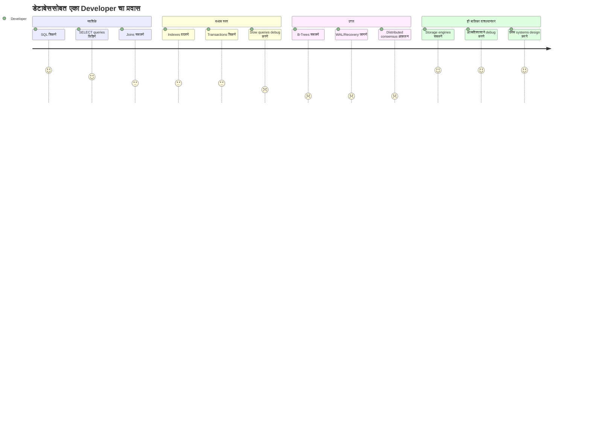
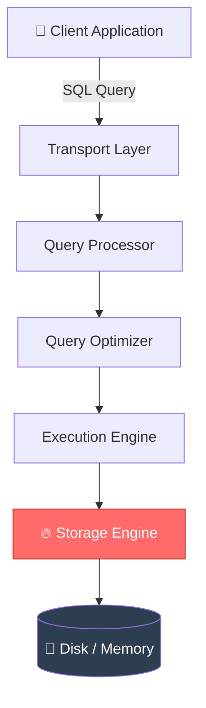

# डेटाबेसच्या आत काय असतं? — एका शिक्षकाचा प्रवास
### *Database Internals Series : हे पुस्तक तुम्ही डेटाबेस पाहण्याची दृष्टीच बदलून टाकेल*

---

मी दहा वर्षांहून अधिक काळ डेटाबेस शिकवला.  
मला वाटायचं — मला सगळं माहीत आहे.  
मग हे पुस्तक वाचायला घेतलं —  
आणि लक्षात आलं, मी फक्त दरवाजा पाहिला होता, आतलं जग कधी पाहिलंच नव्हतं.*

---

## 🎓 ज्या वर्गखोलीने सगळं सुरू केलं

डोळ्यासमोर एक इंजिनिअरिंग कॉलेजची वर्गखोली आणा.  
रांगांमध्ये बसलेले विद्यार्थी, उघड्या वह्या, वर फिरणारे पंखे.  
फळ्यावर लिहिलेलं: **ER Diagrams. Normalization. SQL Joins.**

दहा वर्षांहून अधिक काळ मी त्या फळ्यासमोर उभा राहिलो.  
Primary key, Foreign key, ACID properties, Transaction isolation —  
सगळं शिकवलं.  
1NF, 2NF, 3NF, BCNF —  
जणू एखादा साधू मंत्रपठण करावं तसं.

पण मनाच्या कोपऱ्यात एक प्रश्न नेहमीच खुपत राहिला —  
जो कुठल्याही पाठ्यपुस्तकाने नीट सोडवला नव्हता:

> **जेव्हा मी `SELECT * FROM orders WHERE id = 42` टाइप करतो — तेव्हा डेटाबेसच्या आत नक्की काय घडतं?**

Index माहीत होते.  
B-Tree ची संकल्पना माहीत होती.  
पण *B-Tree disk वर कसं राहतं?*  
*Database crash होऊन परत आल्यावर data सुरक्षित कसा असतो?*  
*Cassandra किंवा MongoDB शेकडो machines वर data ठेवतात — आणि एक byte ही हरवत नाही — हे कसं शक्य आहे?*

पाठ्यपुस्तकं मला **काय** सांगत होती.  
मला **कसं** आणि **का** जाणून घ्यायचं होतं.

एके दिवशी **Alex Petrov यांचं "Database Internals"** हाती घेतलं — आणि जणू दिवा लागला.

---

## 📖 ज्या पुस्तकाने Black Box उघडला

```markmap
# Database Internals — मोठं चित्र

## Part I: Storage Engines
### एकाच machine वर data कसा जगतो
- DBMS Architecture
- Memory vs Disk-Based Storage
- Row vs Column Oriented Layout
- B-Trees — डेटाबेसचं हृदय
- File Formats & Binary Encoding
- Transaction Processing & Recovery
- B-Tree Variants (LMDB, WiredTiger...)
- Log-Structured Storage (LSM Trees)

## Part II: Distributed Systems
### अनेक machines वर data कसा जगतो
- Failure Detection
- Leader Election
- Replication & Consistency
- Anti-Entropy & Gossip
- Distributed Transactions
- Consensus Algorithms (Paxos, Raft, ZAB)
```

Alex Petrov यांनी पाठ्यपुस्तक लिहिलं नाही.  
त्यांनी एक **खजिन्याचा नकाशा** लिहिला —  
जो तुम्हाला डेटाबेसच्या त्या गुप्त कोपऱ्यांमध्ये घेऊन जातो  
जे कुठल्याही कॉलेजच्या अभ्यासक्रमाने कधी दाखवला नाहीत.

पुस्तकाचे दोन भाग आहेत:
- **Part I** उत्तर देतो: *एकाच database node मध्ये data कार्यक्षमतेने कसा साठवला आणि मिळवला जातो?*
- **Part II** उत्तर देतो: *अनेक nodes एकत्र येऊन गोंधळाशिवाय कसं काम करतात?*

---

## 🤯 ५ धक्कादायक तथ्यं

पुढे जाण्याआधी, database internals च्या जगातली ही पाच तथ्यं वाचा —  
पुढच्या वेळी `INSERT` statement लिहाल तेव्हा विचार करायला लावतील:

> 💡 **तथ्य #1:** **B+ Tree** lookup मध्ये **१ अब्ज records** असलेल्या database मध्ये फक्त **३ ते ४ disk reads** लागतात — कारण B+ Trees रुंद आणि उथळ असतात, प्रत्येक node मध्ये हजारो keys असतात.

> 💡 **तथ्य #2:** InnoDB (MySQL चं default engine), PostgreSQL, SQLite, आणि MongoDB चं WiredTiger — हे सगळे **B-Trees** वापरतात. एकच data structure सगळ्यांवर राज्य करतो.

> 💡 **तथ्य #3:** Database crash झाल्यावर त्याला "आठवत" नाही की तो काय करत होता. तो **Write-Ahead Log (WAL)** वापरतो — म्हणजे काम करण्यापूर्वीच लिहिलेली डायरी — आणि त्यावरून सगळं पुनर्संचयित करतो. एखादा आचारी स्वयंपाक करण्यापूर्वी रेसिपी लिहून ठेवतो तसं.

> 💡 **तथ्य #4:** Amazon चा २००७ सालचा **Dynamo paper** — एकट्या एका संशोधनपत्राने — Cassandra (Facebook), Riak (Akamai), आणि Voldemort (LinkedIn) ला जन्म दिला. एक कल्पना. तीन दिग्गज.

> 💡 **तथ्य #5:** Distributed systems मधला consensus problem — अनेक computers ला एका मूल्यावर *सहमत* करणं — हे **गणितीयदृष्ट्या अशक्य असल्याचं सिद्ध झालंय** काही परिस्थितींमध्ये (FLP Impossibility, 1985). तरीही प्रत्येक distributed database हे प्रत्यक्षात सोडवतो. या सुंदर विरोधाभासाचं स्वागत आहे.

---

## 🗺️ ही मालिका का सुरू केली



बहुतांश developers आपलं संपूर्ण करिअर **नवशिके → मध्यम स्तर** या टप्प्यातच घालवतात.  
ते databases ला black box म्हणून वापरतात.  
काही slow झालं की index वापरतात.  
जेव्हा गोष्टी बिघडतात तेव्हा ते सर्व्हर रीस्टार्ट करतात.

ते ठीक आहे - जोपर्यंत ते होत नाही.

जेव्हा database **data गमावतो** आणि तुम्हाला कारण कळत नाही, तेव्हा नाही चालत. 
जेव्हा **system design interview** मध्ये विचारतात की Cassandra eventually consistent का आहे, तेव्हा नाही चालत.  
जेव्हा **production system crash** होतो आणि रात्री २ वाजता WAL recovery logs बघत बसावं लागतं, तेव्हा नाही चालत.

**ही मालिका त्या अंधाऱ्या क्षणांसाठी तुमची टॉर्च आहे.**

---

## 🏗️ डेटाबेस म्हणजे नक्की काय असतं?

आपण "database" हा शब्द सहज वापरतो.  
पण एक database management system (DBMS) म्हणजे एक सुंदर स्तरांमध्ये रचलेली यंत्रणा आहे:



**Storage Engine** हे स्पंदन करणारं हृदय आहे —  
जे खरोखरच data वाचतं आणि लिहितं. बाकी सगळं त्याचं व्यवस्थापन आहे.

आणि हेच बहुतांश पुस्तकं वगळतात.  
ते वरच्या तीन layers बद्दल बोलतात.  
Alex Petrov यांचं पुस्तक थेट **layer 6** मध्ये — storage engine मध्ये — उतरतं, आणि आणखी खोल जातं.

---

## 🧱 प्रत्येक डेटाबेसचे दोन मूलभूत प्रश्न

आजवर बनवलेला प्रत्येक database system फक्त दोन प्रश्नांची उत्तरं देण्याचा प्रयत्न करतो:

```markmap
# डेटाबेसची मूळ समस्या

## Data कसा साठवायचा?
### Disk वर की memory मध्ये?
### Row-by-row की column-by-column?
### कोणती data structure?
- B+ Trees
- LSM Trees
- Hash Tables
### Crash झाल्यावर काय?

## Data कसा वितरित करायचा?
### अनेक machines वर कसा?
### Consistent कसं ठेवायचं?
### एखादी machine बंद पडली तर?
### एकाच सत्यावर कसं सहमत व्हायचं?
- Paxos
- Raft
- ZAB
```

**बस्स एवढंच.**  
PostgreSQL पासून Cassandra पर्यंत, Google Spanner पर्यंत —  
प्रत्येक design निर्णय, प्रत्येक trade-off, प्रत्येक algorithm  
या दोन प्रश्नांपैकी एकाचं उत्तर आहे.

हे पुस्तक दोन्ही सखोलपणे, प्रामाणिकपणे, खऱ्या algorithms आणि खऱ्या systems सह मांडतं.

---

## 👨‍🏫 प्रत्येक प्राध्यापकाने हे पुस्तक का वाचावं

दहा वर्षांहून अधिक काळ databases शिकवलेला माणूस म्हणून सांगतो:

> **आपण विद्यार्थ्यांना databases *कसे वापरायचे* हे शिकवतो. हे पुस्तक databases *कसे काम करतात* हे शिकवतं.**

यात खूप मोठा फरक आहे.

जेव्हा तुम्हाला internals कळतात, तेव्हा शिकवणं बदलतं:
- *"B-Trees indexing साठी वापरतात"* हे सांगणं सोडून *B-Trees disk साठी का optimize केलेले आहेत, RAM साठी नाही* हे सांगता येतं
- *"Transactions ACID ensure करतात"* हे सांगणं सोडून *WAL आणि recovery Durability कशी enforce करते* हे सांगता येतं
- *"Distributed databases eventually consistent असतात"* हे सांगणं सोडून *CAP theorem मुळे हा पर्याय का घ्यावा लागतो* हे सांगता येतं

तुमचे विद्यार्थी चांगले प्रश्न विचारतील.  
त्यांचं system design सुधारेल.  
त्यांची debugging ची सहज बुद्धी तीक्ष्ण होईल.

हे पुस्तक म्हणजे प्रत्येक CS/IT प्राध्यापकाच्या विचारसरणीला आवश्यक असलेलं upgrade आहे.

---

## 💻 प्रत्येक Developer ने हे पुस्तक का वाचावं


हे ज्ञान प्रत्यक्ष आयुष्यात कधी उपयोगी पडतं:

| परिस्थिती | Internals माहीत नसताना | Internals माहीत असताना |
|---|---|---|
| Slow query | index जोडा, प्रार्थना करा | B-Tree traversal समजून मूळ कारण दुरुस्त करा |
| Database crash | Restart करा, आशा करा | WAL logs वाचा, recovery समजा |
| DB निवडताना | StackOverflow तपासा | Storage engines तुलना करून ठरवा |
| System design interview | Buzzwords बोला | Trade-offs खोलवर समजावून सांगा |
| Data corruption | घाबरा | Concurrency control समजून दुरुस्त करा |

---

## 🗺️ या मालिकेचा नकाशा

आपण कुठे कुठे जाणार आहोत:

```mermaid
flowchart TD
    B0("📌 Blog 0 — तुम्ही इथे आहात<br>मालिकेची ओळख"):::done

    B0 --> P1

    subgraph P1["⚙️ Part I — Storage Engines (एकच Node)"]
        direction TB
        B1("Blog 1 — ओळख आणि आढावा<br>DBMS Architecture, Row vs Column, Index Files")
        B2("Blog 2 — B-Tree Basics<br>Binary Search Trees → Disk-Optimized B+ Trees")
        B3("Blog 3 — File Formats<br>Binary Encoding, Slotted Pages, Cell Layout")
        B4("Blog 4 — B-Trees ची अंमलबजावणी<br>Splits, Merges, Page Headers, Bulk Loading")
        B5("Blog 5 — Transactions & Recovery<br>WAL, Buffer Management, ARIES, Isolation")
        B6("Blog 6 — B-Tree Variants<br>LMDB, WiredTiger, Bw-Trees, Lazy B-Trees")
        B7("Blog 7 — Log-Structured Storage<br>LSM Trees, SSTables, Bloom Filters, Compaction")
        B1 --> B2 --> B3 --> B4 --> B5 --> B6 --> B7
    end

    B7 --> P2

    subgraph P2["🌐 Part II — Distributed Systems (अनेक Nodes)"]
        direction TB
        B8("Blog 8 — Distributed Systems ओळख<br>Fallacies, Clocks, Failure Models, FLP Impossibility")
        B9("Blog 9 — Failure Detection<br>Heartbeats, Phi-Accrual, Gossip")
        B10("Blog 10 — Leader Election<br>Bully, Ring, Raft Leader")
        B11("Blog 11 — Replication & Consistency<br>CAP, Linearizability, Eventual Consistency")
        B12("Blog 12 — Anti-Entropy & Gossip<br>Merkle Trees, Hinted Handoff, Read Repair")
        B13("Blog 13 — Distributed Transactions<br>2PC, 3PC, Spanner, Percolator, Calvin")
        B14("Blog 14 — Consensus<br>Paxos, Multi-Paxos, Raft, PBFT, ZAB")
        B8 --> B9 --> B10 --> B11 --> B12 --> B13 --> B14
    end

    classDef done fill:#27ae60,color:#fff,stroke:#1e8449
```



---

## 🎯 ही मालिका कोणासाठी आहे?

```markmap
# वाचक कोण आहेत?

## Developers
### Junior Developers
- SQL च्या मागे काय होतं हे जाणून घ्यायचं आहे
- System design interviews मध्ये चमकायचं आहे
### Senior Developers
- Database निवड शहाणपणाने करायची आहे
- Production issues आत्मविश्वासाने debug करायचे आहेत
### Architects
- Distributed trade-offs नीट समजायला हवेत
- अपयशी न होणारी systems design करायची आहेत

## शिक्षक / प्राध्यापक
### CS/IT Professors
- Database internals खोलवर शिकवायचे आहेत
- अभ्यासक्रमाच्या पलीकडे जायचं आहे
### Curriculum Designers
- Modern storage engine concepts समाविष्ट करायचे आहेत
- Distributed systems theory अभ्यासक्रमात आणायची आहे

## जिज्ञासू वाचक
### विद्यार्थी
- University syllabus च्या पलीकडे जायचं आहे
- Top tech interviews ची तयारी करायची आहे
### Tech Enthusiasts
- गोष्टी कशा काम करतात हे जाणून घेण्याची आवड आहे
- जे manual वाचण्यातही आनंद मानतात ते
```

---

## 🚀 या मालिकेचं वचन

Alex Petrov यांनी हे पुस्तक लिहिण्यासाठी **३०० हून अधिक संशोधनपत्रं**, १५ हून अधिक पुस्तकं,  
असंख्य blog posts, आणि open-source codebases अभ्यासले.  
हे सगळं त्यांनी ~३५० pages मध्ये उतरवलं.

मी ते *आणखी* सुलभ करणार आहे —  
सोप्या, दृश्यात्मक, कथाकथन शैलीच्या blogs मध्ये —  
जेणेकरून तुम्ही विद्यार्थी असाल, developer असाल किंवा प्राध्यापक असाल,  
तुम्ही दररोज वापरत असलेले databases *खरोखर कसे काम करतात* हे समजू शकाल.

कारण black box च्या आत काय आहे हे जाणून घेण्याचा तुम्हाला अधिकार आहे.

> **"जो database हळू data साठवतो तो, जो database लवकर data गमावतो त्यापेक्षा नेहमीच चांगला असतो."**  
> — Alex Petrov, Database Internals

---

## ⏭️ पुढे काय?

**पुढचा blog** **Chapter 1: Introduction and Overview** वर आधारित आहे — जिथे आपण जाणून घेऊ:
- काही databases data memory मध्ये का साठवतात आणि काही disk वर का?
- Row-oriented databases (MySQL) आणि column-oriented databases (Redshift) एकत्र का अस्तित्वात आहेत?
- Data files आणि index files मध्ये काय फरक आहे?
- प्रत्येक storage engine ला आकार देणाऱ्या तीन शक्ती: **Buffering, Immutability, आणि Ordering**

*Spoiler: तुमचा database दर सेकंदाला हजारो सूक्ष्म निर्णय घेत असतो — आणि बहुतांश developers ला हे कधीच माहीत नसतं.*

---

*📌 ही मालिका Alex Petrov यांच्या "Database Internals: A Deep Dive into How Distributed Data Systems Work" (O'Reilly, 2019) या पुस्तकावर आधारित आहे. सर्व संकल्पना शैक्षणिक हेतूने लेखकाच्या स्वतःच्या शब्दांत मांडल्या आहेत.*

*🙏 हे तुम्हाला आवडलं असेल तर एखाद्या developer मित्राला, विद्यार्थ्याला किंवा प्राध्यापक सहकाऱ्याला share करा. 
चांगलं ज्ञान चांगल्या सोबतीनेच फुलतं.*

---
