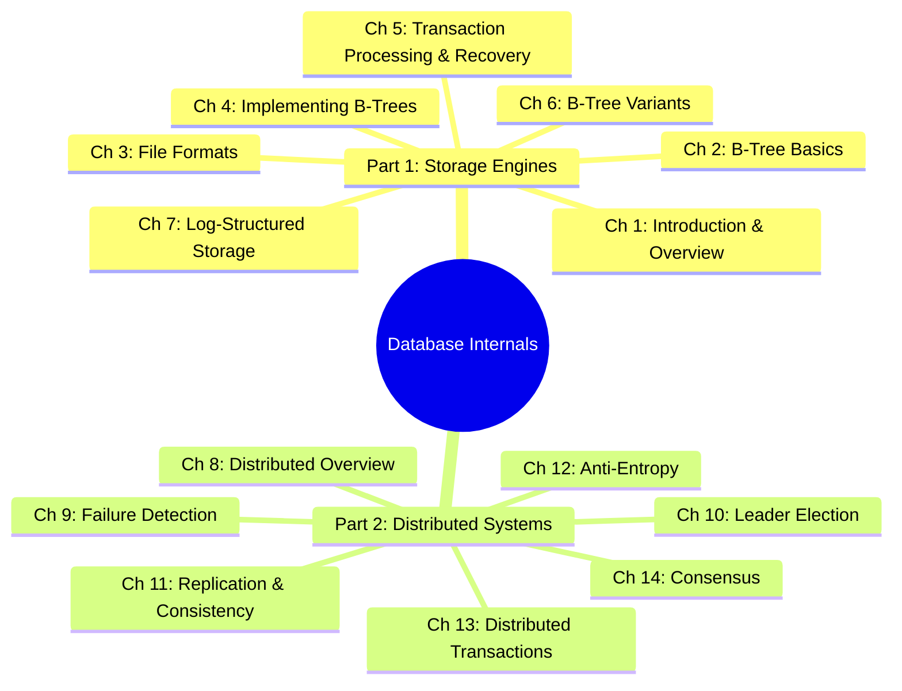
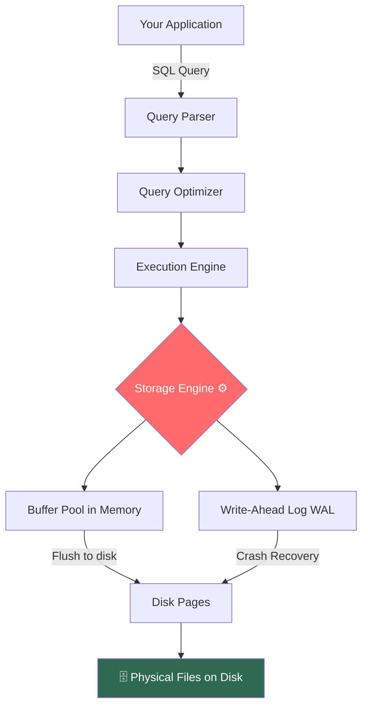
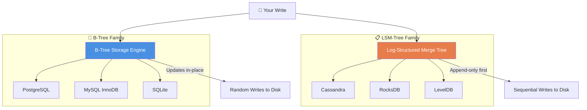
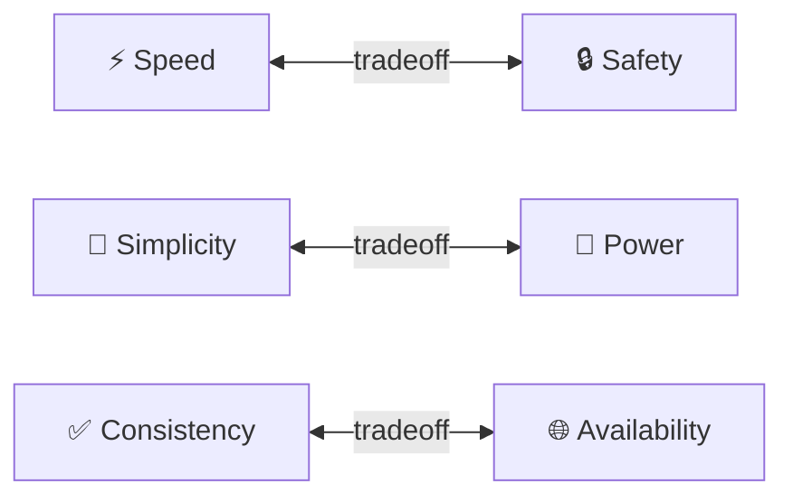

# 🗄️ What Really Happens When You Save Data? — An Introduction to *Database Internals*

> *"Every time you hit 'Save', a battle is being fought deep inside your machine — a battle between speed, durability, and correctness. Welcome to the arena."*

---

## Why This Blog Series?

You use databases every day.  
PostgreSQL, MySQL, MongoDB, Cassandra — they're the backbone of almost every app ever built.

But here's the uncomfortable truth most developers carry around:

**We use databases like magic black boxes. We trust them. We rarely understand them.**

And that's okay… until it isn't. Until your app slows down at scale. Until data corruption sneaks in. Until you have to choose between two databases and don't really know why one is better for your use case.

This blog series is your guided tour through **"Database Internals"** by *Alex Petrov* (O'Reilly, 2019) — one of the most illuminating books ever written about how databases actually work under the hood.

No magic. No hand-waving. Just the beautiful, sometimes brutal truth about bytes, trees, and distributed systems.

---

## 🎯 Who Is This For?

- **Developers** who want to level up from *using* databases to *understanding* them
- **Educators** looking for crisp mental models to teach storage and distributed systems
- Anyone who's ever wondered: *"Why is PostgreSQL slow on this query?"* or *"Why does Cassandra prefer writes over reads?"*

---

## 📖 About the Book

**"Database Internals: A Deep Dive into How Distributed Data Systems Work"**  
*Author: Alex Petrov | Publisher: O'Reilly Media | Year: 2019*

The book is split into **two major parts**:



Think of **Part 1** as understanding how a *single database node* stores and retrieves data reliably.  
**Part 2** is about what happens when you have *multiple nodes* — and they start disagreeing with each other.

---

## 🏛️ Part 1 — Storage Engines: The Foundation of Everything

### The Story of a Write

You type this into your app:

```sql
INSERT INTO users (id, name) VALUES (1, 'Amol');
```

Simple, right? But here's what *actually* happens:



The **Storage Engine** is the heart. It decides:
- How data is laid out on disk
- How fast reads and writes are
- How recovery works after a crash
- Whether you can handle millions or billions of rows

> 💡 **Interesting Fact:** MySQL actually has *swappable* storage engines. The same SQL layer can run on InnoDB (default, B-Tree based), MyISAM, or even an in-memory engine. PostgreSQL deliberately made the opposite choice — one deeply integrated engine. Two philosophies. Both valid. Both with tradeoffs.

---

## 🌳 The Two Great Families of Storage Engines

This is one of the most powerful mental models in the entire book:



**B-Trees** are like a well-organized library. Every book (record) has an exact shelf (page). Finding a book is fast. Reshuffling shelves when new books arrive? That takes work.

**LSM-Trees** are like a journalist taking notes. Everything goes into a notebook first (memory), then later sorted and filed permanently (compaction). Writes are blazing fast. Reads require a bit more searching.

> 🎯 *"Choose B-Tree when reads matter most. Choose LSM when writes are your bottleneck. Choose wrong, and you'll pay the price at 3 AM when your pager goes off."*

---

## ⚡ Why Should You Care? A Real-World Scenario

Imagine you are building a **ride-sharing app** like Ola.

- Every second, thousands of drivers update their GPS location → **Massive writes**
- Occasionally, a rider searches for nearby drivers → **Occasional reads**

If you stored this in PostgreSQL (B-Tree), all those write updates would cause constant random disk I/O — expensive and slow at scale.

But Uber famously uses a system built on top of **MySQL with a heavily customized storage engine**, and companies like Ola use Cassandra (LSM-based) for exactly this kind of write-heavy workload.

The *why* behind that choice? It lives in Chapter 1 of this book.

> 💡 **Interesting Fact:** The original Google Bigtable paper (2006) inspired a whole generation of LSM-tree based databases. Cassandra, HBase, and RocksDB all trace their DNA back to that single 14-page paper. Alex Petrov traces this entire lineage beautifully.

---

## 🤔 A Philosophical Moment Before We Dive In

Here's the core spirit of what Alex Petrov communicates in his preface:

**Databases are not magic. They are engineering tradeoffs.**

Every design decision — B-Tree vs LSM, strong vs eventual consistency, synchronous vs asynchronous replication — is a tradeoff between competing goods:



Understanding *those tradeoffs* is what separates a developer who *uses* databases from an engineer who *masters* them.

> 🌟 *"You don't need to build a database to understand one. But once you understand one — you will never look at your ORM (Object Relational Mapping) the same way again."*

---

## 🚀 Up Next: Blog 1 — Chapter 1: Introduction and Overview

In the next blog, we'll crack open Chapter 1 and explore:
- How storage engines classify themselves
- The anatomy of a full database read/write path
- Why "in-place update" vs "append-only" is a fundamental philosophical divide
- The DBMS architecture that ties everything together

**Follow, bookmark, share** — and get ready to see databases with completely fresh eyes. 👁️

---
